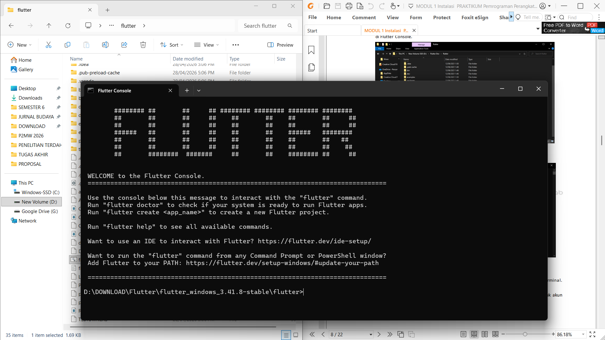
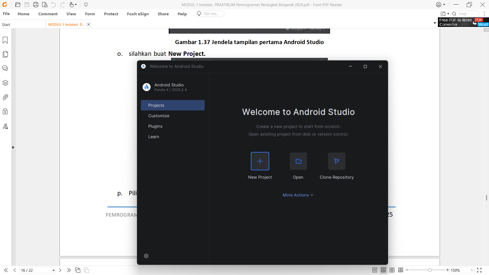
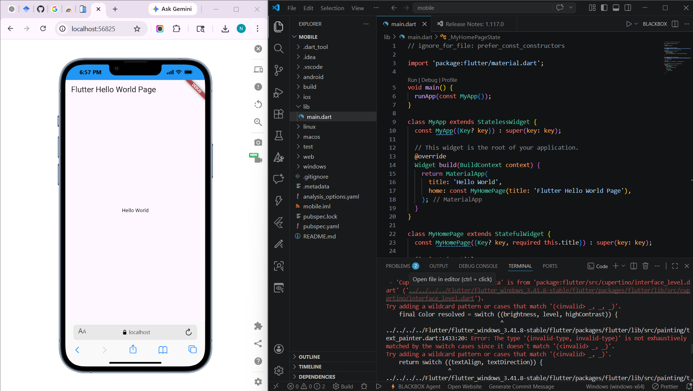

<h1 align="center">LAPORAN PRAKTIKUM</h1>
<h1 align="center">APLIKASI BERBASIS PLATFORM</h1>

 

<h2 align="center">MODUL 1&2</h2>
<h2 align="center">PENGENALAN FLUTTER</h2>

  

   

<h2 align="center">Disusun Oleh :</h2>

  <b>Nofita Fitriyani</b> 
  <b>2311102001</b> 
  <b>S1 IF-11-REG 01</b>

 
<h2 align="center">Dosen Pengampu :</h2>

  <b>Dimas Fanny Hebrasianto Permadi, S.ST., M.Kom</b>

 
<h2 align="center">Asisten Praktikum :</h2>

  <b>Apri Pandu Wicaksono</b> 
  <b>Rangga Pradarrell Fathi</b>

 
<h1 align="center">LABORATORIUM HIGH PERFORMANCE</h1>
<h1 align="center">FAKULTAS INFORMATIKA</h1>
<h1 align="center">UNIVERSITAS TELKOM PURWOKERTO</h1>
<h1 align="center">TAHUN 2026</h1>

## DASAR TEORI
Flutter adalah framework open-source yang dikembangkan oleh Google untuk membangun aplikasi lintas platform seperti mobile, web, dan desktop hanya dengan satu codebase. Flutter menggunakan bahasa pemrograman Dart serta didukung oleh Skia Graphics Engine untuk merender tampilan secara langsung ke layar tanpa bergantung pada komponen native. Salah satu keunggulan utama Flutter adalah fitur hot reload yang memungkinkan developer melihat perubahan kode secara langsung tanpa harus melakukan build ulang aplikasi, sehingga proses pengembangan menjadi lebih cepat dan efisien.
## SCREENSHOT EVIDENCE
### 1. Instalasi Flutter

### 2. Instalasi Android Studio

### 3. Project Hello World

