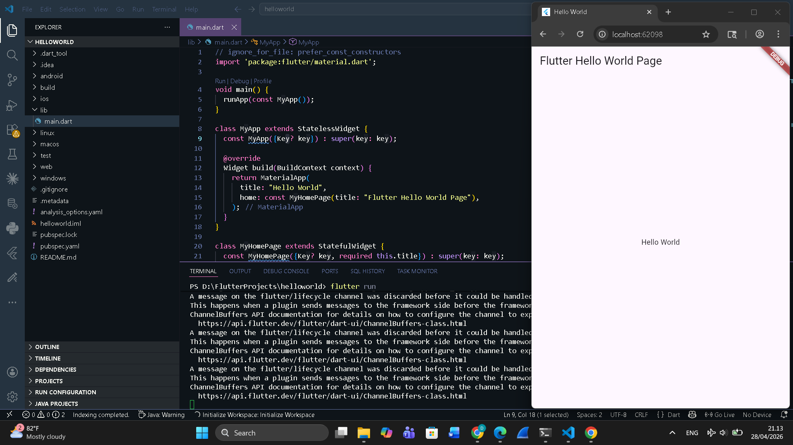

<div align="center">

## LAPORAN PRAKTIKUM <br> APLIKASI BERBASIS PLATFORM

<br>

### MODUL 1 & 2
### MOBILE

<br>
<br>


<br>
<br>
<br>

**Disusun oleh:**

**Diva Octaviani**  
**2311102006**

<br>

**KELAS PS1IF-11-REG01**

**Dosen: Dimas Fanny Hebrasianto Permadi, S.ST., M.Kom**

<br><br>

## PROGRAM STUDI S1 TEKNIK INFORMATIKA <br> FAKULTAS INFORMATIKA <br> UNIVERSITAS TELKOM PURWOKERTO <br> 2026 <br><br>

</div>

---

## 1. Dasar Teori

Flutter ditulis menggunakan bahasa C, C++, dan Dart dengan Google's Skia Graphics Engine untuk user interface. Flutter berjalan menggunakan Dart Virtual Machine (VM) di sistem operasi Windows, Linux, dan macOS. Dart VM menggunakan kompilasi kode just-in-time (JIT) yang menyediakan fitur hot-reload untuk menghemat waktu pengembangan.

Flutter API menggabungkan beberapa widget sesuai kebutuhan aplikasi. Widget bisa **stateless** atau **stateful** tergantung pada status widget itu sendiri, yang berguna untuk membantu mengelola status aplikasi.

Flutter juga memiliki arsitektur dasar yang disebut **Business Logic Component (BLOC)**, yaitu pendekatan untuk memisahkan logika bisnis dari antarmuka dengan ide inti berupa *simplicity*, *scalability*, dan *testability*.

---

## 2. Hasil Praktikum

### Langkah-Langkah:

**1.** Buka Visual Studio Code dan pastikan extension **Flutter** dan **Dart** sudah terpasang.

**2.** Buat project Flutter baru melalui menu **View → Command Palette → Flutter: New Project → Application**, pilih folder tujuan, beri nama project, lalu tekan Enter dan tunggu hingga proses selesai.

**3.** Setelah project selesai dibuat, buka file `lib/main.dart`, lalu hapus semua kode yang ada.

**4.** Tambahkan kode berikut pada `main.dart`:

```dart
// ignore_for_file: prefer_const_constructors

import 'package:flutter/material.dart';

void main() {
  runApp(const MyApp());
}

class MyApp extends StatelessWidget {
  const MyApp({Key? key}) : super(key: key);

  // This widget is the root of your application.
  @override
  Widget build(BuildContext context) {
    return MaterialApp(
      title: "Hello World",
      home: const MyHomePage(title: "Flutter Hello World Page"),
    ); // MaterialApp
  }
}

class MyHomePage extends StatefulWidget {
  const MyHomePage({Key? key, required this.title}) : super(key: key);

  final String title;

  @override
  State<MyHomePage> createState() => _MyHomePageState();
}

class _MyHomePageState extends State<MyHomePage> {
  @override
  Widget build(BuildContext context) {
    return Scaffold(
      appBar: AppBar(
        title: Text(widget.title),
      ),
      body: Center(
        child: Text(
          'Hello World',
        ),
      ),
    );
  }
}
```

**5.** Jalankan aplikasi dengan perintah `flutter run` di terminal, lalu pilih platform yang diinginkan (web/emulator).

### Output:

