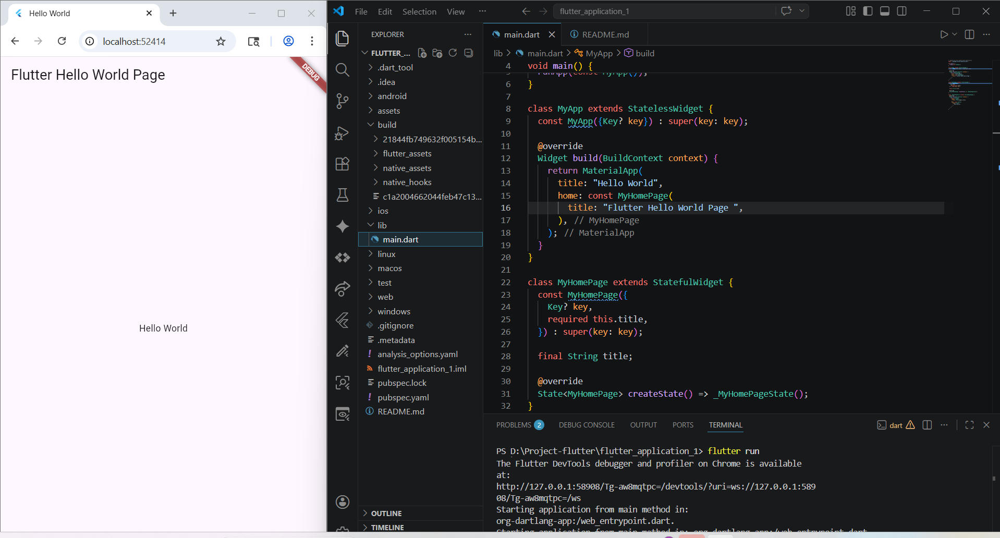

   
  <h1>LAPORAN PRAKTIKUM  APLIKASI BERBASIS PLATFORM</h1>
   
  <h3>MODUL 01,02 - Mobile   Pengenalan Flutter  </h3>
   
   
   
   
   
  <h3>Disusun Oleh :</h3>
  

    <strong>Arjun Werdho Kumoro</strong> 
    <strong>2311102009</strong> 
    <strong>IF-11-REG01</strong>
  

   
  <h3>Dosen Pengampu :</h3>
  

    <strong>Dimas Fanny Hebrasianto Permadi, S.ST., M.Kom</strong>
  

   
   
    <h4>Asisten Praktikum :</h4>
    <strong> Apri Pandu Wicaksono </strong>  
    <strong>Rangga Pradarrell Fathi</strong>
   
  <h3>LABORATORIUM HIGH PERFORMANCE
  FAKULTAS INFORMATIKA  UNIVERSITAS TELKOM PURWOKERTO  2026</h3>

---
### Hasil Praktek :
