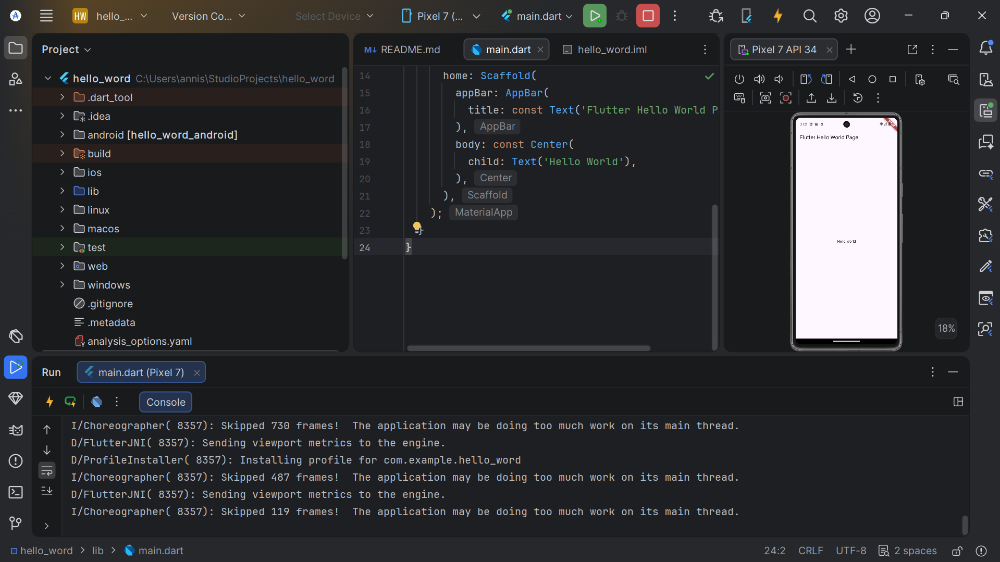

   
  <h1>LAPORAN PRAKTIKUM  APLIKASI BERBASIS PLATFORM</h1>
   
  <h2>MODUL 01,02 - Mobile   Pengenalan Flutter </h2>
   
   
   
   
   
   
  <h3>Disusun Oleh :</h3>
  

    <strong>Annisa Al Jauhar</strong> 
    <strong>2311102014</strong> 
    <strong>S1 IF-11-REG 01</strong>
  

   
  <h3>Dosen Pengampu :</h3>
  

    <strong>Dimas Fanny Hebrasianto Permadi, S.ST., M.Kom</strong>
  

   
   
  <h4>Asisten Praktikum :</h4>
    <strong> Apri Pandu Wicaksono </strong>  
    <strong>Rangga Pradarrell Fathi</strong>
   
  <h2>LABORATORIUM HIGH PERFORMANCE
  FAKULTAS INFORMATIKA  UNIVERSITAS TELKOM PURWOKERTO  2026</h2>

---

# 1. Dasar Teori

Flutter adalah framework open-source dari Google untuk membangun aplikasi mobile, web, dan desktop dengan satu codebase menggunakan bahasa Dart dan Skia Graphics Engine. Dengan dukungan Dart VM dan kompilasi JIT, Flutter menyediakan fitur hot reload yang memungkinkan perubahan kode langsung terlihat tanpa build ulang.

Flutter menggunakan konsep widget tree, di mana UI dibangun dari widget yang tersusun hierarkis, terdiri dari stateless dan stateful widget. Untuk arsitektur, Flutter mendukung pemisahan logika dan tampilan, salah satunya dengan BLoC, yang mengelola event dan state agar aplikasi lebih terstruktur, scalable, dan mudah diuji.

Sebagai awal, biasanya dibuat aplikasi "Hello World" untuk memahami struktur dasar seperti MaterialApp, Scaffold, AppBar, serta widget Text dan Center.

---

# 2. Screenshot Tampilan (hasil)

## Hasil Hello World

Gambar di atas merupakan tampilan Android Studio saat menjalankan aplikasi Flutter. Pada bagian toolbar atas terlihat project bernama hello_word sedang berjalan di emulator Pixel 7 API 34. Panel kiri menampilkan struktur folder project Flutter yang terdiri dari folder android, lib, ios, web, dan lainnya. Panel tengah merupakan editor yang menampilkan isi file main.dart berisi widget Scaffold, AppBar, dan Text('Hello World') sebagai inti tampilan aplikasi. Panel kanan menampilkan hasil running aplikasi pada emulator Pixel 7, dengan AppBar bertuliskan "Flutter Hello World Page" dan teks "Hello World" di tengah layar. Panel bawah menampilkan log proses build dan running aplikasi.