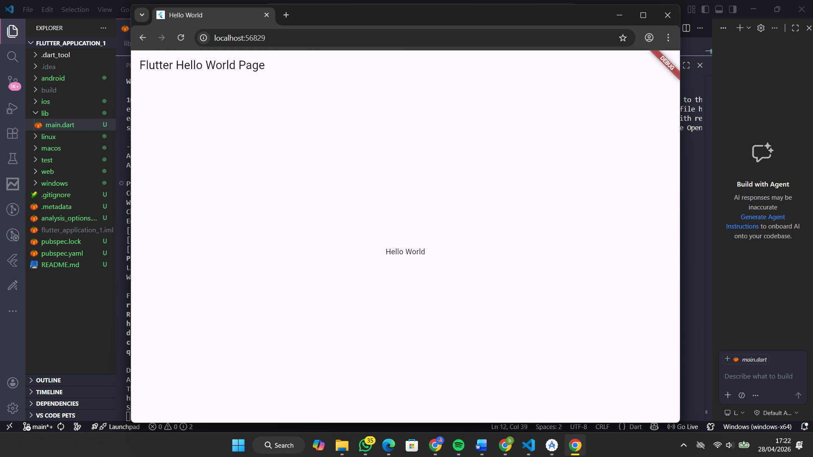

<div align="center">

# LAPORAN PRAKTIKUM
# APLIKASI BERBASIS PLATFORM


## MODUL 1-2
## Hello World


**Disusun Oleh :**

**Sherine Naura Early Gunawan**

**2311102020**

**S1 IF-11-REG01**


**PROGRAM STUDI S1 INFORMATIKA**

**FAKULTAS INFORMATIKA**

**UNIVERSITAS TELKOM PURWOKERTO**

**2025/2026**

</div>

---

## 1. Dasar Teori

### A. Flutter
Flutter merupakan framework modern yang dibangun menggunakan kombinasi bahasa pemrograman C, C++, dan Dart. Kekuatan utama visualnya terletak pada penggunaan Google’s Skia Graphics Engine, sebuah mesin grafis berperforma tinggi yang juga menjadi tulang punggung bagi produk-produk ternama seperti Google Chrome, Android, hingga Mozilla Firefox. Dalam proses pengembangannya, Flutter memanfaatkan Dart Virtual Machine (VM) agar dapat berjalan secara optimal di berbagai sistem operasi, mulai dari Windows, Linux, hingga macOS. Keunggulan teknis lainnya adalah implementasi kompilasi kode Just-In-Time (JIT) pada Dart VM, yang memungkinkan hadirnya fitur Hot-Reload. Fitur ini menjadi terobosan penting bagi pengembang karena mampu memperbarui perubahan kode secara instan tanpa harus melakukan proses build ulang, sehingga waktu pengembangan aplikasi menjadi jauh lebih efisien.

---

## 2. Source Code
```dart
// ignore_for_file: prefer_const_constructors
import 'package:flutter/material.dart';

void main() {
  runApp(const MyApp());
}

class MyApp extends StatelessWidget {
  const MyApp({Key? key}) : super(key: key);
  // This widget is the root of your application.
  @override
  Widget build(BuildContext context) {
    return MaterialApp(
      title: "Hello World",
      home: const MyHomePage(title: "Flutter Hello World Page"),
    );
  }
}

class MyHomePage extends StatefulWidget {
  const MyHomePage({Key? key, required this.title}) : super(key: key);
  final String title;
  @override
  State<MyHomePage> createState() => _MyHomePageState();
}

class _MyHomePageState extends State<MyHomePage> {
  @override
  Widget build(BuildContext context) {
    return Scaffold(
      appBar: AppBar(title: Text(widget.title)),
      body: Center(child: Text('Hello World')),
    );
  }
}
```

---

## 3. Hasil

<div align="center">
    
</div>