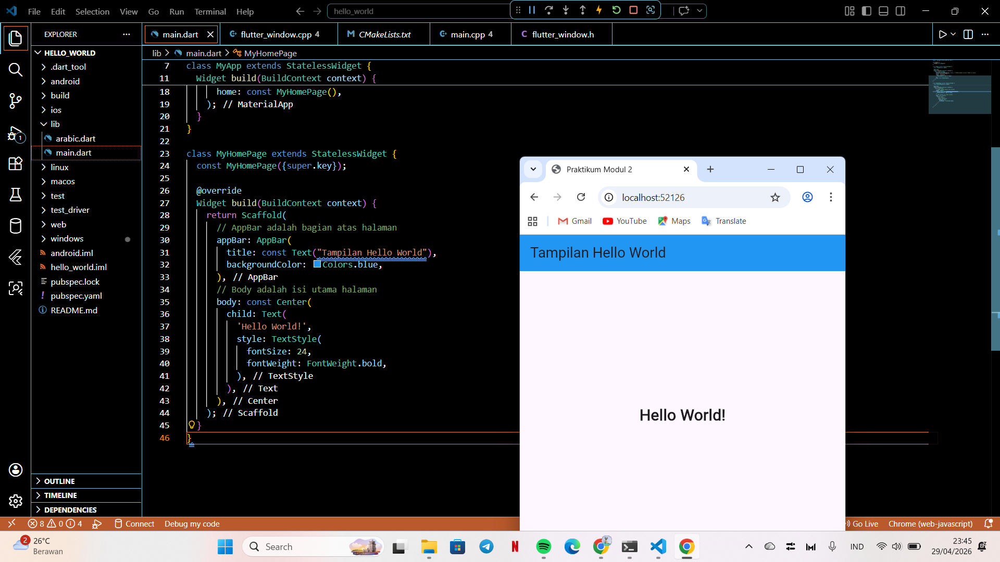

   
  <h1>LAPORAN PRAKTIKUM  APLIKASI BERBASIS PLATFORM</h1>
   
  <h3> Modul 01-02 Mobile   Hello World</h3>
   
   
   
   
   
  <h3>Disusun Oleh :</h3>
  

    <strong>Shiva Indah Kurnia</strong> 
    <strong>2311102035</strong> 
    <strong>S1 IF-11-01</strong>
  

   
  <h3>Dosen Pengampu :</h3>
  

    <strong>Dimas Fanny Hebrasianto Permadi, S.ST., M.Kom</strong>
  

   
   
    <h4>Asisten Praktikum :</h4>
    <strong> Apri Pandu Wicaksono </strong>  
    <strong>Rangga Pradarrell Fathi</strong>
   
  <h3>LABORATORIUM HIGH PERFORMANCE
  FAKULTAS INFORMATIKA  UNIVERSITAS TELKOM PURWOKERTO  2026</h3>

## 1. Penjelasan Lengkap Pembuatan Proyek

### A. Flutter
Flutter merupakan kerangka kerja sumber terbuka besutan Google yang dirancang untuk menciptakan antarmuka aplikasi berperforma tinggi melalui satu basis kode tunggal. Berbeda dengan metode pengembangan konvensional, teknologi ini memungkinkan implementasi aplikasi pada berbagai platform seperti Android, iOS, web, dan desktop secara efisien. Mengandalkan bahasa Dart dan arsitektur berbasis widget, Flutter menawarkan fleksibilitas penuh dalam kustomisasi elemen visual. Selain itu, fitur Stateful Hot Reload menjadi nilai tambah yang krusial dalam mempercepat proses pengembangan karena mampu menampilkan pembaruan kode secara real-time.

### Hasil Penugasan

