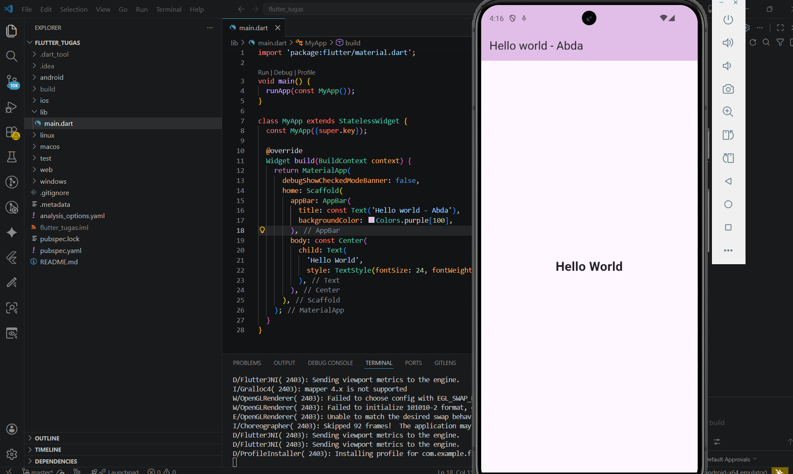

   

  <h1>LAPORAN PRAKTIKUM  
  APLIKASI BERBASIS PLATFORM
  </h1>

   

  <h3> Modul 1-2 Mobile</h3>
Flutter (Hello World)
   
  
  </h3>

   

  

   
   
   

  <h3>Disusun Oleh :</h3>

  

    <strong>Abda Firas Rahman</strong> 
    <strong>2311102049</strong> 
    <strong>S1 IF-11-REG01</strong>
  

   

  <h3>Dosen Pengampu :</h3>

  

    <strong>Dimas Fanny Hebrasianto Permadi, S.ST., M.Kom</strong>
  

  
   
   
    <h4>Asisten Praktikum :</h4>
    <strong>Apri Pandu Wicaksono </strong>  
    <strong>Rangga Pradarrell Fathi</strong>
   

  <h3>LABORATORIUM HIGH PERFORMANCE
  FAKULTAS INFORMATIKA  UNIVERSITAS TELKOM PURWOKERTO  2026</h3>

### Dasar Teori
1. Flutter adalah framework open-source yang dikembangkan oleh Google untuk membuat aplikasi multi-platform dengan tampilan menarik dan performa tinggi menggunakan satu basis kode saja. Dengan kata lain, pengembang cukup menulis kode sekali menggunakan bahasa Dart, lalu aplikasi tersebut dapat dijalankan di berbagai platform seperti Android, iOS, web, dan desktop tanpa perlu membuat proyek terpisah.
Salah satu keunggulan utama Flutter adalah fitur Hot Reload, yang memungkinkan perubahan kode langsung terlihat secara instan di emulator tanpa harus menunggu proses kompilasi yang lama. Selain itu, Flutter tidak bergantung pada komponen UI bawaan sistem, melainkan merender tampilannya sendiri melalui mesin grafisnya, sehingga menghasilkan desain yang konsisten, modern, dan responsif di berbagai perangkat.

2. Android Studio adalah perangkat lunak resmi yang dikembangkan oleh Google untuk membuat aplikasi Android. Aplikasi ini menyediakan berbagai fitur lengkap seperti editor kode, emulator, dan alat debugging yang membantu pengembang dalam merancang, menguji, serta menjalankan aplikasi dengan lebih mudah dan efisien.

### Hasil

