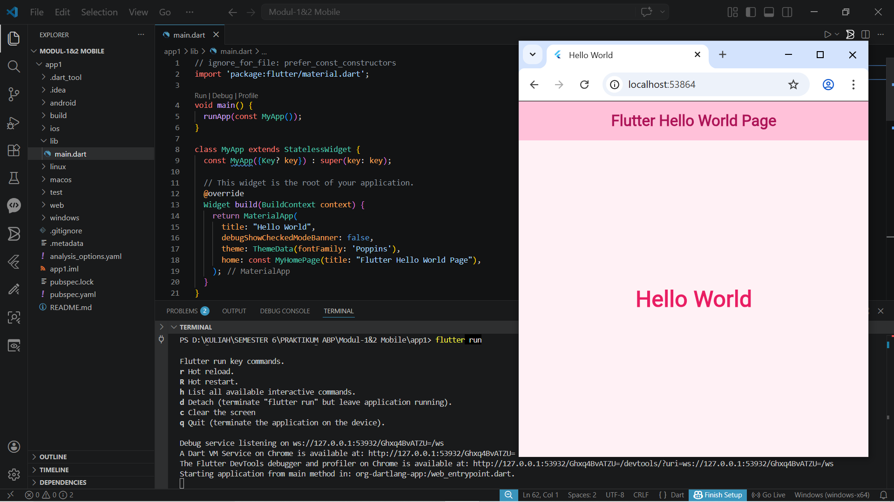

<div align="center">
  <br />
  <h1>LAPORAN PRAKTIKUM <br> PEMROGRAMAN MOBILE</h1>
  <br />
  <h3>MODUL 1 - 2 MOBILE <br> PENGENALAN FLUTTER DAN HELLO WORLD</h3>
  <br />
  
  <br />
  <br />
  <br />
  <h3>Disusun Oleh :</h3>
  <p>
    <strong>Nia Novela Ariandini</strong><br>
    <strong>2311102057</strong><br>
    <strong>S1 IF-11-01</strong>
  </p>
  <br />
  <h3>Dosen Pengampu :</h3>
  <p>
    <strong>Dimas Fanny Hebrasianto Permadi, S.ST., M.Kom</strong>
  </p>
  <br />
  <br />
  <h4>Asisten Praktikum :</h4>
  <strong>Apri Pandu Wicaksono</strong> <br>
  <strong>Rangga Pradarrell Fathi</strong>
  <br />
  <br />
  <br />
  <br />
  <h3>LABORATORIUM HIGH PERFORMANCE <br> FAKULTAS INFORMATIKA <br> UNIVERSITAS TELKOM PURWOKERTO <br> 2026</h3>
</div>

---

# DASAR TEORI

## 1. Flutter

Flutter adalah Software Development Kit (SDK) dari Google yang digunakan untuk membuat aplikasi multiplatform menggunakan bahasa Dart.

## 2. Dart

Dart adalah bahasa pemrograman yang digunakan dalam Flutter untuk membuat logika dan tampilan aplikasi.

## 3. Widget

Dalam Flutter, seluruh tampilan disusun menggunakan widget. Contohnya:

* MaterialApp
* Scaffold
* AppBar
* Text
* Center

---

# HASIL PRAKTIKUM

## 1. Kode Program main.dart

```dart
// ignore_for_file: prefer_const_constructors
import 'package:flutter/material.dart';

void main() {
  runApp(const MyApp());
}

class MyApp extends StatelessWidget {
  const MyApp({Key? key}) : super(key: key);

  // This widget is the root of your application.
  @override
  Widget build(BuildContext context) {
    return MaterialApp(
      title: "Hello World",
      debugShowCheckedModeBanner: false,
      theme: ThemeData(fontFamily: 'Poppins'),
      home: const MyHomePage(title: "Flutter Hello World Page"),
    );
  }
}

class MyHomePage extends StatefulWidget {
  const MyHomePage({Key? key, required this.title}) : super(key: key);

  final String title;

  @override
  State<MyHomePage> createState() => _MyHomePageState();
}

class _MyHomePageState extends State<MyHomePage> {
  @override
  Widget build(BuildContext context) {
    return Scaffold(
      backgroundColor: Color(0xFFFFF1F5),
      appBar: AppBar(
        backgroundColor: Color(0xFFFFC1D9),
        elevation: 0,
        centerTitle: true,
        title: Text(
          widget.title,
          style: TextStyle(
            color: Color(0xFFAD1457),
            fontWeight: FontWeight.w600,
          ),
        ),
      ),
      body: Center(
        child: Text(
          'Hello World',
          style: TextStyle(
            fontSize: 32,
            fontWeight: FontWeight.bold,
            color: Color(0xFFE91E63),
          ),
        ),
      ),
    );
  }
}
```

---

## 2. Penjelasan Kode Program

### Import Library

```dart
import 'package:flutter/material.dart';
```

Digunakan untuk memanggil library Material Design Flutter.

### Fungsi Main

```dart
void main() {
  runApp(const MyApp());
}
```

Merupakan fungsi utama yang pertama kali dijalankan.

### Class MyApp

Digunakan sebagai root aplikasi dan memanggil MaterialApp.

### MaterialApp

Berfungsi untuk mengatur:

* Judul aplikasi
* Theme aplikasi
* Halaman awal aplikasi

### MyHomePage

Widget halaman utama aplikasi.

### Scaffold

Digunakan sebagai struktur dasar tampilan, berisi:

* AppBar
* Body
* Background Color

---

# HASIL SCREENSHOT


# KESIMPULAN

Berdasarkan praktikum modul 1 dan 2, dapat disimpulkan bahwa Flutter memudahkan pembuatan aplikasi mobile dengan tampilan menarik dan kode yang sederhana. File `main.dart` merupakan file utama yang digunakan untuk menjalankan aplikasi. Dengan widget dasar seperti MaterialApp, Scaffold, dan Text, aplikasi sederhana Hello World dapat dibuat dengan mudah.

---

# REFRENSI

1. Dokumentasi Flutter Resmi. https://flutter.dev
2. Dokumentasi Dart. https://dart.dev
3. Modul 1 & 2 Pemrograman Perangkat Bergerak

