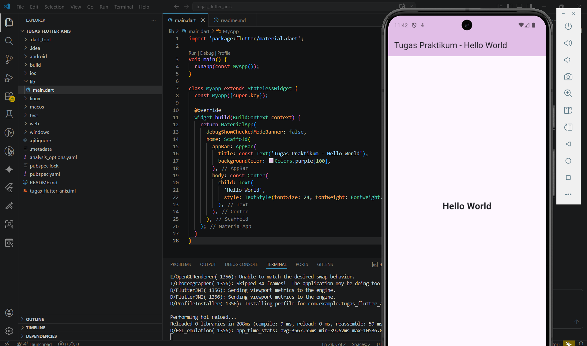

   

  <h1>LAPORAN PRAKTIKUM  
  APLIKASI BERBASIS PLATFORM
  </h1>

   

  <h3>Modul 1-2 Mobile</h3>
Hello World
   
  
  </h3>

   

  

   
   
   

  <h3>Disusun Oleh :</h3>

  

    <strong>Aisyah Anis Mazaya </strong> 
    <strong>2311102095</strong> 
    <strong>S1 IF-11-REG01</strong>
  

   

  <h3>Dosen Pengampu :</h3>

  

    <strong>Dimas Fanny Hebrasianto Permadi, S.ST., M.Kom</strong>
  

  
   
   
    <h4>Asisten Praktikum :</h4>
    <strong>Apri Pandu Wicaksono </strong>  
    <strong>Rangga Pradarrell Fathi</strong>
   

  <h3>LABORATORIUM HIGH PERFORMANCE
  FAKULTAS INFORMATIKA  UNIVERSITAS TELKOM PURWOKERTO  2026</h3>

### Dasar Teori
Flutter adalah sebuah framework open-source yang dikembangkan oleh Google untuk membangun aplikasi multi-platform yang cantik dan berperforma tinggi hanya dengan menggunakan satu basis kode (single codebase). Artinya, kamu cukup menulis kode satu kali menggunakan bahasa pemrograman Dart, dan aplikasi tersebut bisa langsung dijalankan di Android, iOS, web, hingga desktop tanpa harus membuat project terpisah untuk tiap platform.

Keunggulan utama Flutter terletak pada fitur Hot Reload, yang memungkinkan pengembang melihat perubahan kode secara instan di emulator tanpa harus menunggu proses kompilasi yang lama. Selain itu, Flutter tidak menggunakan komponen UI bawaan sistem, melainkan menggambar setiap pikselnya sendiri menggunakan mesin grafisnya, sehingga tampilan aplikasi akan terlihat konsisten, modern, dan sangat responsif di berbagai jenis perangkat.

### Hasil

