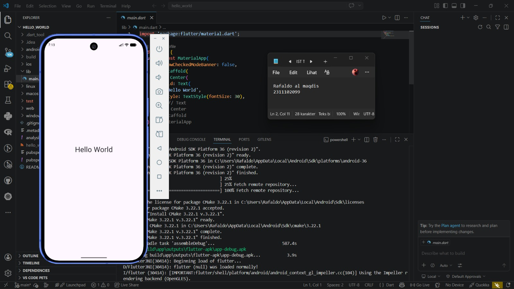

<div align="center">
  <br />
  <h1>LAPORAN PRAKTIKUM <br>APLIKASI BERBASIS PLATFORM</h1>
  <br />
  <h2>MODUL 1 & 2 FLUTTER <br>HTML</h2>
  <br /><br />

  

  <br /><br /><br />

  <h3>Disusun Oleh :</h3>

  <p>
    <strong>Rafaldo Al Maqdis</strong><br>
    <strong>2311102099</strong><br>
    <strong>S1 IF-11-REG 01</strong>
  </p>

  <br />

  <h3>Dosen Pengampu :</h3>

  <p>
    <strong>Dimas Fanny Hebrasianto Permadi, S.ST., M.Kom</strong>
  </p>

  <br /><br />

  <h4>Asisten Praktikum :</h4>

  <p>
    <strong>Apri Pandu Wicaksono</strong><br>
    <strong>Rangga Pradarrell Fathi</strong>
  </p>

  <br />

  <h2>
  LABORATORIUM HIGH PERFORMANCE <br>
  FAKULTAS INFORMATIKA <br>
  UNIVERSITAS TELKOM PURWOKERTO <br>
  2026
  </h2>
</div>

---

### 1. Konsep Pengembangan Aplikasi Mobile

Aplikasi mobile adalah perangkat lunak yang dirancang untuk berjalan pada perangkat bergerak seperti smartphone dan tablet. Pengembangan aplikasi mobile tidak hanya berfokus pada penulisan kode, tetapi juga memperhatikan tampilan, performa, kompatibilitas perangkat, serta kemudahan pengguna dalam menggunakan aplikasi. Karena perangkat mobile memiliki ukuran layar dan spesifikasi yang berbeda-beda, pengembang perlu menggunakan framework dan tools yang dapat membantu proses pembuatan aplikasi secara lebih efisien.

Pada praktikum ini, framework yang digunakan adalah Flutter. Flutter dipilih karena mampu membangun aplikasi multiplatform dari satu basis kode. Dengan Flutter, mahasiswa dapat membuat aplikasi Android sederhana, memahami struktur proyek, serta mengenal konsep dasar widget yang menjadi komponen utama dalam pembuatan antarmuka.

### 2. Perangkat Pendukung Pengembangan Flutter

Sebelum membuat aplikasi Flutter, komputer harus memiliki beberapa tools pendukung. Tools tersebut meliputi Git, JDK, Flutter SDK, Android Studio, Android SDK, Visual Studio Code, dan ekstensi Flutter serta Dart. Komponen-komponen ini diperlukan agar proses pembuatan, kompilasi, dan pengujian aplikasi dapat berjalan dengan baik.

Git digunakan untuk membantu pengelolaan versi proyek. Melalui Git, perubahan kode dapat dicatat sehingga pengembang dapat melihat riwayat perubahan dan mengembalikan proyek ke versi sebelumnya apabila terjadi kesalahan. Selain itu, Git juga sering digunakan dalam proses pengambilan dependensi atau source code dari repository tertentu.

JDK atau Java Development Kit dibutuhkan karena pengembangan aplikasi Android masih berkaitan dengan ekosistem Java. JDK menyediakan compiler, runtime, dan utilitas lain yang diperlukan dalam proses build. Pada sistem operasi Windows, JDK biasanya perlu ditambahkan ke environment variable agar perintah Java dapat dikenali melalui terminal.

Flutter SDK adalah inti dari pengembangan aplikasi Flutter. SDK ini berisi perintah, pustaka, dan komponen yang diperlukan untuk membuat proyek Flutter. Setelah Flutter SDK diinstal, path menuju folder `flutter/bin` perlu ditambahkan ke environment variable agar perintah `flutter` dapat dijalankan dari Command Prompt, PowerShell, atau terminal.

Android Studio berfungsi sebagai penyedia Android SDK, emulator, dan Android toolchain. Walaupun proses penulisan kode dapat dilakukan di Visual Studio Code, Android Studio tetap penting karena menyediakan komponen yang diperlukan untuk menjalankan aplikasi Flutter pada Android. Android SDK sendiri berisi platform, build tools, platform tools, dan emulator yang dibutuhkan dalam proses pengembangan.

Visual Studio Code digunakan sebagai editor kode. Dengan memasang ekstensi Flutter dan Dart, VS Code dapat digunakan untuk membuat proyek Flutter, menjalankan aplikasi, melakukan debugging, memilih device, dan menggunakan fitur hot reload.

### 3. Flutter SDK dan Perintah `flutter doctor`

Flutter SDK menyediakan command-line tools yang digunakan untuk membuat proyek baru, menjalankan aplikasi, mengelola dependensi, dan memeriksa konfigurasi sistem. Salah satu perintah penting dalam Flutter adalah `flutter doctor`. Perintah ini digunakan untuk mengecek apakah semua kebutuhan pengembangan sudah terpasang dengan benar.

Hasil dari `flutter doctor` biasanya menampilkan beberapa bagian, seperti Flutter SDK, Android toolchain, browser, Android Studio, VS Code, dan connected device. Jika terdapat tanda peringatan atau error, maka bagian tersebut perlu diperbaiki terlebih dahulu sebelum aplikasi dijalankan.

### 4. Dart sebagai Bahasa Pemrograman

Flutter menggunakan bahasa pemrograman Dart. Dart merupakan bahasa yang mendukung konsep pemrograman berorientasi objek dan memiliki sintaks yang relatif mudah dipahami. Dalam Flutter, Dart digunakan untuk menulis logika program sekaligus menyusun tampilan antarmuka melalui widget.

Pada saat pengembangan, Dart mendukung kompilasi JIT atau *Just-In-Time*. Pendekatan ini memungkinkan perubahan kode diterapkan dengan cepat saat aplikasi masih berjalan. Fitur ini dikenal sebagai hot reload. Ketika aplikasi akan dirilis, Dart dapat menggunakan kompilasi AOT atau *Ahead-Of-Time* agar aplikasi memiliki performa yang lebih baik.

### 5. Flutter dan Konsep Widget

Flutter adalah UI toolkit yang digunakan untuk membangun aplikasi dengan susunan widget. Widget merupakan elemen dasar yang membentuk tampilan aplikasi. Pada Flutter, hampir semua bagian antarmuka adalah widget, termasuk teks, tombol, gambar, layout, halaman, dan struktur aplikasi.

Widget dalam Flutter disusun dalam bentuk *widget tree*. Widget tree adalah struktur bertingkat yang menunjukkan hubungan antara widget induk dan widget anak. Misalnya, sebuah halaman dapat memiliki widget `Scaffold`, lalu di dalamnya terdapat `Center`, dan di dalam `Center` terdapat `Text`. Susunan tersebut membentuk tampilan akhir yang muncul pada layar aplikasi.

Secara umum, widget dapat dibagi menjadi dua jenis, yaitu `StatelessWidget` dan `StatefulWidget`. `StatelessWidget` digunakan untuk tampilan yang tidak berubah, sedangkan `StatefulWidget` digunakan untuk tampilan yang dapat berubah ketika ada perubahan data atau interaksi pengguna.

### 6. Layout dalam Flutter

Layout adalah cara mengatur posisi dan ukuran widget pada layar. Flutter menyediakan banyak widget layout, seperti `Center`, `Column`, `Row`, `Container`, `Padding`, dan `Expanded`. Setiap widget memiliki fungsi yang berbeda. `Center` digunakan untuk menempatkan widget anak di tengah layar, `Column` menyusun widget secara vertikal, sedangkan `Row` menyusun widget secara horizontal.

Pemahaman tentang layout sangat penting dalam pembuatan aplikasi mobile karena tampilan aplikasi harus dapat menyesuaikan ukuran layar perangkat. Dengan menggunakan widget layout secara tepat, antarmuka aplikasi dapat terlihat lebih rapi, terstruktur, dan mudah digunakan.

### 7. Material Design, `MaterialApp`, dan `Scaffold`

Flutter menyediakan dukungan terhadap Material Design melalui pustaka `material.dart`. Material Design adalah pedoman desain yang umum digunakan pada aplikasi Android. Dalam Flutter, aplikasi berbasis Material biasanya diawali dengan widget `MaterialApp`.

`MaterialApp` berfungsi sebagai pembungkus utama aplikasi. Widget ini dapat mengatur tema, navigasi, judul aplikasi, dan halaman awal. Pada bagian halaman, Flutter biasanya menggunakan `Scaffold`. `Scaffold` menyediakan struktur dasar halaman seperti area utama atau `body`, `AppBar`, drawer, tombol mengambang, dan navigasi bawah.

Pada program Hello World, struktur yang digunakan masih sederhana. Program hanya memakai `MaterialApp`, `Scaffold`, `Center`, dan `Text`. Meskipun sederhana, contoh tersebut sudah menunjukkan konsep utama Flutter, yaitu membangun antarmuka melalui susunan widget.

### 8. Arsitektur Flutter dan Pengelolaan State

Flutter memiliki arsitektur berlapis. Lapisan framework menyediakan widget dan API yang digunakan langsung oleh pengembang. Lapisan engine menangani proses rendering, animasi, teks, dan eksekusi Dart. Lapisan embedder menghubungkan Flutter dengan sistem operasi yang digunakan.

Dalam pengembangan aplikasi yang lebih kompleks, pengelolaan state menjadi hal penting. State adalah data atau kondisi yang memengaruhi tampilan aplikasi. Salah satu pola arsitektur yang dapat digunakan untuk mengelola state adalah BLoC atau *Business Logic Component*. BLoC bertujuan memisahkan logika bisnis dari tampilan sehingga kode lebih rapi, mudah diuji, dan mudah dikembangkan.

### 9. Program Hello World pada Flutter

Program Hello World adalah contoh dasar untuk memastikan bahwa proyek Flutter dapat dibuat dan dijalankan. Program ini menampilkan teks sederhana di tengah layar. Walaupun singkat, program Hello World memperkenalkan beberapa konsep penting seperti fungsi `main()`, `runApp()`, widget utama, struktur halaman, layout, dan tampilan teks.

Berikut kode pada file `lib/main.dart`:

```dart
import 'package:flutter/material.dart';

void main() {
  runApp(const MaterialApp(
    debugShowCheckedModeBanner: false,
    home: Scaffold(
      body: Center(
        child: Text(
          'Hello World',
          style: TextStyle(fontSize: 30),
        ),
      ),
    ),
  ));
}
```

### 10. Penjelasan Kode `lib/main.dart`

Kode di atas dapat dijelaskan sebagai berikut:

- `import 'package:flutter/material.dart';`  
  Digunakan untuk memanggil pustaka Material Flutter. Dengan pustaka ini, program dapat menggunakan widget seperti `MaterialApp`, `Scaffold`, `Center`, `Text`, dan `TextStyle`.

- `void main()`  
  Merupakan fungsi utama pada program Dart. Fungsi ini menjadi titik awal saat aplikasi dijalankan.

- `runApp(...)`  
  Berfungsi menjalankan aplikasi Flutter dengan menerima widget sebagai akar dari aplikasi. Widget yang dimasukkan ke dalam `runApp()` akan menjadi tampilan utama yang dirender oleh Flutter.

- `const MaterialApp(...)`  
  Merupakan widget utama yang menyediakan struktur aplikasi berbasis Material Design. Kata kunci `const` digunakan karena konfigurasi widget pada contoh ini tidak berubah.

- `debugShowCheckedModeBanner: false`  
  Digunakan untuk menghilangkan label debug yang biasanya tampil di pojok kanan atas ketika aplikasi dijalankan dalam mode debug.

- `home: Scaffold(...)`  
  Menentukan halaman pertama yang ditampilkan oleh aplikasi. Pada kode ini, halaman pertama menggunakan `Scaffold`.

- `Scaffold`  
  Berfungsi sebagai kerangka halaman. Pada contoh ini, bagian yang digunakan hanya `body`, yaitu area utama dari halaman aplikasi.

- `body: Center(...)`  
  Menentukan isi halaman utama. Widget `Center` membuat isi yang berada di dalamnya tampil di tengah layar.

- `child: Text(...)`  
  Menentukan widget anak dari `Center`. Widget anak pada program ini adalah teks.

- `'Hello World'`  
  Merupakan string atau teks yang akan ditampilkan pada layar aplikasi.

- `style: TextStyle(fontSize: 30)`  
  Digunakan untuk mengatur gaya teks. Properti `fontSize: 30` membuat ukuran teks menjadi lebih besar sehingga mudah dibaca.

Dari struktur tersebut dapat dipahami bahwa Flutter menampilkan antarmuka dengan cara menyusun widget dari bagian paling luar hingga bagian paling dalam. `MaterialApp` menjadi pembungkus aplikasi, `Scaffold` menjadi halaman, `Center` mengatur posisi, dan `Text` menampilkan tulisan.

### 11. Screeshoot



### 12. Kesimpulan

Praktikum instalasi dan pengenalan Flutter memberikan pemahaman awal mengenai persiapan lingkungan pengembangan aplikasi mobile. Beberapa komponen seperti Git, JDK, Flutter SDK, Android Studio, Android SDK, VS Code, serta ekstensi Flutter dan Dart harus dikonfigurasi agar aplikasi dapat dibuat dan dijalankan. Flutter menggunakan bahasa Dart dan membangun tampilan melalui widget tree. Contoh program Hello World menunjukkan bahwa sebuah aplikasi Flutter sederhana dapat dibuat dengan menyusun beberapa widget dasar seperti `MaterialApp`, `Scaffold`, `Center`, dan `Text`.

## Referensi

 Git Documentation. Git Reference. https://git-scm.com/docs
 Oracle Documentation. Java SE Documentation. https://docs.oracle.com/javase/
 Android Developers. Download Android Studio & App Tools. https://developer.android.com/studio
 Android Developers. Run apps on the Android Emulator. https://developer.android.com/studio/run/emulator
 Flutter Documentation. Install Flutter. https://docs.flutter.dev/install
 Flutter Documentation. Visual Studio Code. https://docs.flutter.dev/tools/vs-code
 Flutter Documentation. Building user interfaces with Flutter. https://docs.flutter.dev/ui
 Flutter API Documentation. `MaterialApp` class. https://api.flutter.dev/flutter/material/MaterialApp-class.html
 Flutter API Documentation. `Scaffold` class. https://api.flutter.dev/flutter/material/Scaffold-class.html
 Flutter API Documentation. `Center` class. https://api.flutter.dev/flutter/widgets/Center-class.html
 Flutter API Documentation. `Text` class. https://api.flutter.dev/flutter/widgets/Text-class.html
 Flutter API Documentation. `runApp` function. https://api.flutter.dev/flutter/widgets/runApp.html
 Dart Documentation. Dart overview. https://dart.dev/overview

---

A few resources to get you started if this is your first Flutter project:

- [Learn Flutter](https://docs.flutter.dev/get-started/learn-flutter)
- [Write your first Flutter app](https://docs.flutter.dev/get-started/codelab)
- [Flutter learning resources](https://docs.flutter.dev/reference/learning-resources)

For help getting started with Flutter development, view the
[online documentation](https://docs.flutter.dev/), which offers tutorials,
samples, guidance on mobile development, and a full API reference.
