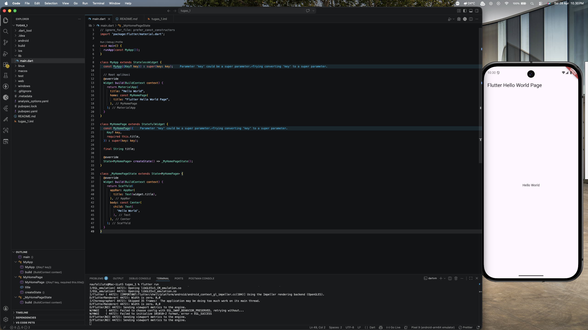

<div align="center">
  <br />
  <h1>LAPORAN PRAKTIKUM</h1>
  <h2>APLIKASI BERBASIS PLATFORM</h2>
  <br />
  <h3>Flutter Hello World</h3>
  <br />
  <br />
  
  <br />
  <br />
  <h3>Disusun Oleh :</h3>
  <p>
    <strong>NAUFAL LUTHFI ASSARY</strong><br>
    <strong>2311102125</strong><br>
    <strong>S1 IF-11-REG01</strong>
  </p>
  <br />
  <h3>Dosen Pengampu :</h3>
  <p>
    <strong>Dimas Fanny Hebrasianto Permadi, S.ST., M.Kom</strong>
  </p>
  <br />
  <h4>Asisten Praktikum :</h4>
  <p>
    <strong>Apri Pandu Wicaksono</strong><br>
    <strong>Rangga Pradarrell Fathi</strong>
  </p>
  <br />
  <h3>
    LABORATORIUM HIGH PERFORMANCE<br>
    FAKULTAS INFORMATIKA<br>
    UNIVERSITAS TELKOM PURWOKERTO<br>
    2026
  </h3>
</div>

---

## 1. Dasar Teori Flutter

Flutter adalah framework bersifat open-source yang dibuat oleh Google untuk mengembangkan aplikasi pada berbagai platform, seperti mobile, web, dan desktop, hanya dengan menggunakan satu basis kode. Framework ini menggunakan bahasa pemrograman Dart dan memanfaatkan Skia Graphics Engine dalam proses perenderan antarmuka pengguna. Flutter juga didukung oleh Dart Virtual Machine (VM) yang memungkinkan proses kompilasi just-in-time (JIT). Dukungan tersebut membuat fitur hot reload dapat berjalan, sehingga pengembang dapat melihat perubahan kode secara langsung tanpa perlu melakukan proses build ulang secara keseluruhan.

Dalam pembuatan antarmuka pengguna, Flutter menerapkan konsep utama yang disebut widget tree. Konsep ini merupakan susunan hierarkis dari berbagai widget, di mana setiap elemen tampilan direpresentasikan sebagai sebuah widget. Secara umum, widget dalam Flutter dibagi menjadi dua jenis, yaitu stateless widget dan stateful widget. Stateless widget digunakan untuk tampilan yang tidak mengalami perubahan kondisi, sedangkan stateful widget digunakan pada tampilan yang dapat berubah akibat interaksi pengguna maupun perubahan kondisi tertentu. Pembagian ini membantu pengembang dalam mengatur tampilan dan status aplikasi secara lebih rapi, terstruktur, serta modular.

Selain berfokus pada antarmuka, Flutter juga mendukung penerapan arsitektur yang memisahkan logika aplikasi dari tampilan. Salah satu pendekatan yang sering digunakan adalah Business Logic Component (BLoC). Pada arsitektur ini, setiap event yang terjadi dalam aplikasi akan diproses dan menghasilkan perubahan state sebagai respons. Pemisahan antara logika bisnis dan antarmuka pengguna melalui BLoC dapat membantu meningkatkan keteraturan kode, mempermudah pengembangan, mendukung skalabilitas, serta memudahkan proses pengujian aplikasi.

Sebagai tahap awal untuk memahami Flutter, pengembang biasanya membuat aplikasi sederhana seperti “Hello World”. Aplikasi tersebut digunakan untuk mengenalkan struktur dasar program Flutter, termasuk penggunaan widget utama seperti MaterialApp, Scaffold, dan AppBar, serta pengaturan tampilan menggunakan widget seperti Text dan Center. Melalui contoh sederhana ini, pengembang dapat memahami alur dasar pembuatan aplikasi Flutter, mulai dari proses inisialisasi hingga tampilan antarmuka muncul pada layar.

---

## 2. Penjelasan Kode

```dart
// ignore_for_file: prefer_const_constructors
import 'package:flutter/material.dart';

void main() {
  runApp(const MyApp());
}

class MyApp extends StatelessWidget {
  const MyApp({Key? key}) : super(key: key);

  // Root aplikasi
  @override
  Widget build(BuildContext context) {
    return MaterialApp(
      title: "Hello World",
      home: const MyHomePage(
        title: "Flutter Hello World Page",
      ),
    );
  }
}

class MyHomePage extends StatefulWidget {
  const MyHomePage({
    Key? key,
    required this.title,
  }) : super(key: key);

  final String title;

  @override
  State<MyHomePage> createState() => _MyHomePageState();
}

class _MyHomePageState extends State<MyHomePage> {
  @override
  Widget build(BuildContext context) {
    return Scaffold(
      appBar: AppBar(
        title: Text(widget.title),
      ),
      body: const Center(
        child: Text(
          'Hello World',
        ),
      ),
    );
  }
}
```

Kode program tersebut adalah contoh aplikasi sederhana “Hello World” yang dibuat menggunakan framework Flutter. Program diawali dengan fungsi main() sebagai titik masuk utama ketika aplikasi dijalankan. Di dalam fungsi tersebut, terdapat pemanggilan runApp() yang berfungsi untuk menjalankan widget utama, yaitu MyApp. Kelas MyApp merupakan turunan dari StatelessWidget, sehingga tidak menyimpan atau mengelola perubahan state selama aplikasi berjalan. Pada method build(), kelas ini mengembalikan widget MaterialApp yang berperan sebagai kerangka utama aplikasi. Di dalamnya terdapat beberapa properti, seperti title dan home, yang digunakan untuk menentukan halaman awal aplikasi, yaitu MyHomePage.

Selanjutnya, MyHomePage didefinisikan sebagai StatefulWidget karena halaman ini dapat memiliki perubahan kondisi atau state. Widget ini menerima parameter title yang nantinya ditampilkan pada bagian AppBar. Pengelolaan state dari MyHomePage dilakukan melalui kelas _MyHomePageState, yang melakukan override terhadap method build() untuk membentuk tampilan antarmuka aplikasi. Pada bagian layout, digunakan widget Scaffold sebagai struktur dasar halaman yang menyediakan elemen seperti AppBar dan body. AppBar menampilkan judul yang diperoleh dari widget.title, sedangkan bagian body menggunakan widget Center untuk menempatkan konten di bagian tengah layar. Konten tersebut berupa widget Text yang menampilkan tulisan “Hello World”. Secara keseluruhan, kode ini menggambarkan pola dasar pembuatan aplikasi Flutter yang memanfaatkan widget sebagai komponen utama penyusun antarmuka pengguna.

---

## 3. Screenshot Hasil



---

## 4. Referensi

- Flutter Docs: [https://docs.flutter.dev](https://docs.flutter.dev)
- Dart: [https://dart.dev](https://dart.dev)
