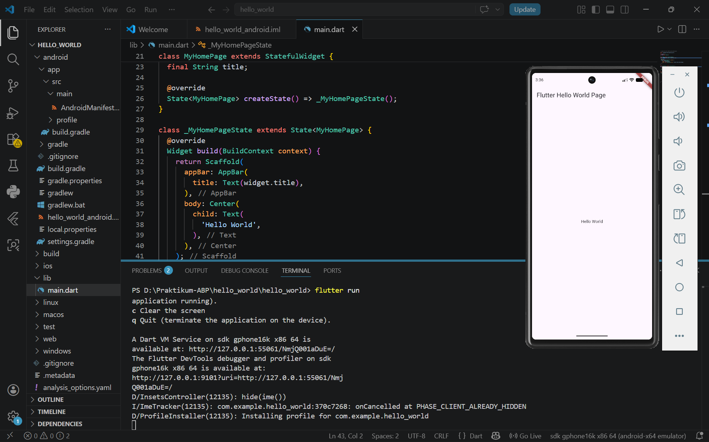

   

  <h1>LAPORAN PRAKTIKUM  
  APLIKASI BERBASIS PLATFORM
  </h1>

   

  <h3>Modul 1-2 Mobile</h3>
Hello World
   
  
  </h3>

   

  

   
   
   

  <h3>Disusun Oleh :</h3>

  

    <strong>Agnes Refilina Fiska </strong> 
    <strong>2311102126</strong> 
    <strong>S1 IF-11-REG01</strong>
  

   

  <h3>Dosen Pengampu :</h3>

  

    <strong>Dimas Fanny Hebrasianto Permadi, S.ST., M.Kom</strong>
  

  
   
   
    <h4>Asisten Praktikum :</h4>
    <strong>Apri Pandu Wicaksono </strong>  
    <strong>Rangga Pradarrell Fathi</strong>
   

  <h3>LABORATORIUM HIGH PERFORMANCE
  FAKULTAS INFORMATIKA  UNIVERSITAS TELKOM PURWOKERTO  2026</h3>

### Dasar Teori
Flutter bukan sekadar library, melainkan SDK (Software Development Kit) lengkap yang dikembangkan oleh Google. Filosofi utamanya adalah memberikan kendali penuh atas setiap piksel pada layar kepada pengembang.

1. `Arsitektur "Everything is a Widget"`
Di dalam Flutter, Widget adalah unit dasar dari antarmuka pengguna. Widget tidak hanya mendefinisikan tampilan (seperti tombol), tetapi juga fungsionalitas (seperti alignment atau gesture).
- `Widget Tree`: Flutter menyusun UI sebagai sebuah pohon hierarki.
- `Root Widget`: Biasanya berupa MaterialApp (untuk desain Android) atau CupertinoApp (untuk desain iOS).
- `Parent & Child`: Widget yang menampung widget lain (seperti Column atau Container) bertindak sebagai orang tua yang mengatur posisi anak-anaknya.

2. `Paradigma UI Deklaratif`
Berbeda dengan pengembangan Android/iOS tradisional yang bersifat Imperatif (di mana kita memberi perintah langkah demi langkah untuk mengubah UI), Flutter bersifat Deklaratif.
- Konsep: Kamu mendefinisikan state (keadaan) aplikasi saat ini, dan Flutter akan membangun kembali UI sesuai dengan keadaan tersebut.
- Rumus:
  `UI = f(state)`
  Artinya, tampilan (UI) adalah fungsi dari data aplikasi(state)

3. `Pengelolaan State (State Management)`
Memahami perbedaan antara dua jenis widget utama sangatlah krusial:
- StatelessWidget: Widget yang datanya bersifat statis atau tidak berubah setelah dibangun (immutable), Contoh Logo, Teks Judul, Icon.
- StatefulWidget: Widget yang memiliki keadaan internal dan dapat berubah selama aplikasi berjalan, contoh Checkbox, Form Input, Slider.

4. `Bahasa Pemrograman Dart`
Flutter menggunakan bahasa Dart, yang memiliki dua mode kompilasi unik yang memberikan pengalaman pengembangan terbaik:

- JIT (Just-in-Time Compilation): Digunakan selama proses pengembangan. Ini adalah teknologi di balik Hot Reload, yang memungkinkan kamu mengubah kode dan melihat hasilnya dalam kurang dari satu detik tanpa kehilangan state aplikasi.

- AOT (Ahead-of-Time Compilation): Digunakan saat merilis aplikasi. Kode dikompilasi menjadi kode mesin native (ARM/x64), sehingga aplikasi berjalan sangat lancar (mencapai 60-120 FPS).

5. `Rendering Engine: Skia & Impeller`
Salah satu teori paling fundamental adalah bagaimana Flutter menggambar UI. Flutter tidak menggunakan komponen UI bawaan sistem operasi (OEM Widgets).

- Self-Rendering: Flutter membawa mesin gambarnya sendiri. Jika kamu membuat tombol di Flutter, mesin tersebut akan menggambar persegi dan teks di atas layar menggunakan piksel, bukan memanggil tombol milik Android atau iOS.

- Keuntungan: Konsistensi total. Aplikasi kamu akan terlihat sama persis di Android versi lama maupun iOS versi terbaru.

6. `Arsitektur Lapisan (Layered Architecture)`
Flutter didesain secara modular agar pengembang bisa mengontrol bagian mana pun:

- Framework Layer (Dart): Lapisan yang paling sering kita sentuh. Berisi Material Design, Cupertino, Widgets, dan Rendering logic.

- Engine Layer (C++): Menangani tugas berat seperti rendering grafis, komunikasi jaringan, dan dukungan aksesibilitas.

- Embedder Layer: Lapisan spesifik platform yang memungkinkan Flutter berjalan di Android, iOS, Windows, atau Web.

7. `Layouting: Constraints Flow Down, Sizes Go Up`
Ini adalah aturan emas dalam tata letak Flutter:

1. Constraints Flow Down: Orang tua (Parent) memberikan batasan (misal: lebar minimal dan maksimal) ke anaknya.

2. Sizes Go Up: Anak menentukan ukurannya sendiri berdasarkan batasan tersebut dan memberitahu orang tuanya.

3. Parent Sets Position: Orang tua menentukan di mana posisi anak tersebut akan diletakkan di layar.

### Hasil

