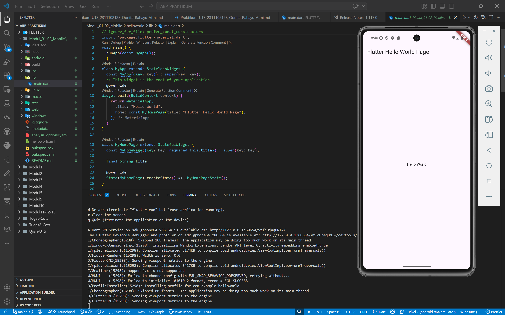

<div align="center">
  <br />
  <h1>LAPORAN PRAKTIKUM <br>APLIKASI BERBASIS PLATFORM</h1>
  <br />
  <h3>MODUL 1 & 2 <br> MOBILE</h3>
  <br />
  <br />
   
  <br />
  <br />
  <br />
  <h3>Disusun Oleh :</h3>
  <p>
    <strong>Qonita Rahayu Atmi</strong><br>
    <strong>2311102128</strong><br>
    <strong>S1 IF-11-REG01</strong><br>
  </p>
  <br />
  <h3>Dosen Pengampu :</h3>
  <p>
    <strong>Dimas Fanny Hebrasianto Permadi, S.ST., M.Kom</strong>
  </p>
  <br />
  <h3>Asisten Praktikum :</h3>
  <p>
    <strong>Apri Pandu Wicaksono</strong><br>
    <strong>Rangga Pradarrell Fathi</strong><br>
  </p>
  <br />
  <h3>LABORATORIUM HIGH PERFORMANCE<br>FAKULTAS INFORMATIKA <br>TELKOM UNIVERSITY PURWOKERTO <br>2026</h3>
</div>

---


## A. DASAR TEORI

Flutter adalah framework UI yang dibangun menggunakan bahasa pemrograman C, C++, dan Dart. Framework ini memanfaatkan *Google’s Skia Graphics Engine* untuk merender antarmuka pengguna, mesin yang sama yang digunakan pada berbagai produk populer seperti Google Chrome, Android, dan Mozilla Firefox. Flutter beroperasi di atas *Dart Virtual Machine (VM)* pada platform Windows, Linux, maupun macOS. Keunggulan utamanya adalah pemanfaatan kompilasi *Just-In-Time (JIT)* pada Dart VM yang memungkinkan fitur *hot-reload*, sehingga proses pengembangan menjadi lebih efisien.

Secara arsitektur, Flutter menggunakan konsep *widget tree*, di mana antarmuka dibangun melalui susunan widget yang saling bersarang (nested). Widget-widget ini digabungkan melalui API Flutter untuk memenuhi kebutuhan komponen visual aplikasi. Widget sendiri dibedakan menjadi dua tipe: *stateless* dan *stateful*. Perbedaan keduanya terletak pada kemampuan widget dalam menyimpan dan memperbarui status (*state*), yang berperan krusial dalam manajemen data dan interaksi pengguna dalam aplikasi.


## B. PENJELASAN KODE

Berikut adalah penjelasan pada file `main.dart` yang digunakan dalam proyek ini:

### Import & Entry Point
```dart
import 'package:flutter/material.dart';

void main() {
  runApp(const MyApp());
}
```
**Penjelasan:** `import` digunakan untuk memanggil pustaka, yang merupakan standar antarmuka untuk aplikasi Flutter. Selanjutnya, terdapat fungsi `main()` yang bertindak sebagai gerbang utama eksekusi program. Di dalamnya, fungsi `runApp()` menginstruksikan Flutter untuk merender widget akar, yaitu `MyApp`, ke layar perangkat. Penggunaan kata kunci `const` pada `MyApp()` bertujuan untuk efisiensi memori karena objek tersebut bersifat tetap.

### Class MyApp (StatelessWidget)
```dart
class MyApp extends StatelessWidget {
  const MyApp({Key? key}) : super(key: key);

  @override
  Widget build(BuildContext context) {
    return MaterialApp(
      title: "Hello World",
      home: const MyHomePage(title: "Flutter Hello World Page"),
    );
  }
}
```
**Penjelasan:** Kelas `MyApp` didefinisikan sebagai `StatelessWidget` karena struktur dasar aplikasi ini tidak memerlukan perubahan data secara dinamis. Fungsi `build()` di sini berfungsi menyusun arsitektur aplikasi menggunakan widget `MaterialApp`. Widget ini mengatur konfigurasi fundamental seperti `title` yang muncul pada sistem (*task switcher*) serta menentukan halaman awal melalui properti `home`, yang di sini diarahkan ke `MyHomePage`.

### Class MyHomePage (StatefulWidget)
```dart
class MyHomePage extends StatefulWidget {
  const MyHomePage({Key? key, required this.title}) : super(key: key);

  final String title;

  @override
  State<MyHomePage> createState() => _MyHomePageState();
}
```
**Penjelasan:** `MyHomePage` menggunakan `StatefulWidget`, untuk halaman ini dirancang untuk dapat menangani perubahan keadaan (*state*) apabila ditambahkan fitur yang interaktif. Kelas ini menerima parameter `title` yang bersifat wajib (`required`), di mana teks tersebut disimpan dalam variabel `final` sehingga nilainya tidak dapat diubah setelah diinisialisasi. Fungsi `createState()` menghubungkan widget ini dengan kelas pengelola tampilan, yaitu `_MyHomePageState`.

### Class _MyHomePageState (State)
```dart
class _MyHomePageState extends State<MyHomePage> {
  @override
  Widget build(BuildContext context) {
    return Scaffold(
      appBar: AppBar(
        title: Text(widget.title),
      ),
      body: Center(
        child: Text(
          'Hello World',
        ),
      ),
    );
  }
}
```
**Penjelasan:** Kelas `_MyHomePageState` adalah tempat di mana desain visual halaman dikonstruksi secara detail. Menggunakan widget `Scaffold`, kita membuat kerangka standar aplikasi yang mencakup area atas (`AppBar`) dan area konten (`body`). Judul pada `AppBar` diambil dari kelas induk menggunakan sintaks `widget.title`. Di bagian tengah layar, diterapkan widget `Center` yang menampung widget `Text` untuk menampilkan pesan "Hello World". Kombinasi widget-widget ini memastikan teks berada tepat di pusat layar baik secara horizontal maupun vertikal.

**Alur Widget Tree Aplikasi:**

```text
main()
└── runApp(MyApp)
    └── MyApp
        └── MaterialApp
            └── MyHomePage
                └── Scaffold
                    ├── AppBar
                    │    └── Text("Flutter Hello World Page")
                    └── Center
                         └── Text("Hello World")
```


## C. HASIL PRAKTIKUM



