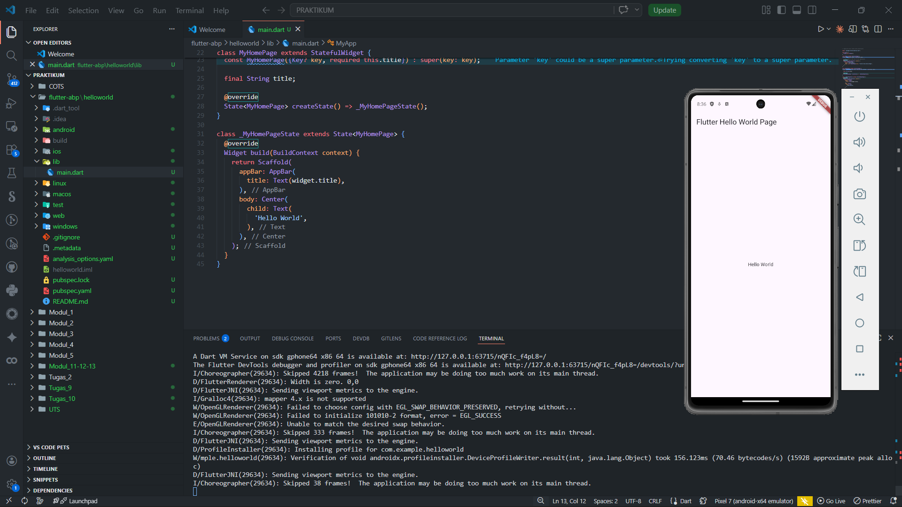

<div align="center">
  <br />
  <h1>LAPORAN PRAKTIKUM</h1>
  <h2>APLIKASI BERBASIS PLATFORM</h2>
  <br />
  <h3>Flutter Hello World</h3>
  <br />
  <br />
  
  <br />
  <br />
  <h3>Disusun Oleh :</h3>
  <p>
    <strong>HAMID SABIRIN</strong><br>
    <strong>2311102129</strong><br>
    <strong>S1 IF-11-REG01</strong>
  </p>
  <br />
  <h3>Dosen Pengampu :</h3>
  <p>
    <strong>Dimas Fanny Hebrasianto Permadi, S.ST., M.Kom</strong>
  </p>
  <br />
  <h4>Asisten Praktikum :</h4>
  <p>
    <strong>Apri Pandu Wicaksono</strong><br>
    <strong>Rangga Pradarrell Fathi</strong>
  </p>
  <br />
  <h3>
    LABORATORIUM HIGH PERFORMANCE<br>
    FAKULTAS INFORMATIKA<br>
    UNIVERSITAS TELKOM PURWOKERTO<br>
    2026
  </h3>
</div>

---

## 1. Dasar Teori Flutter

**Flutter** adalah framework open-source buatan **Google** untuk membangun aplikasi lintas platform (*cross-platform*) — Android, iOS, Web, dan Desktop — dari satu basis kode (*single codebase*). Flutter menggunakan bahasa pemrograman **Dart**.

### Konsep Utama Flutter

Konsep paling mendasar dalam Flutter adalah **Widget**. Widget merupakan elemen dasar pembentuk UI — segala sesuatu yang tampil di layar, mulai dari teks, tombol, gambar, hingga layout, semuanya adalah widget. Flutter membagi widget menjadi dua jenis utama: **StatelessWidget**, yaitu widget yang tampilannya tidak berubah setelah dibangun dan cocok digunakan untuk UI yang bersifat statis; serta **StatefulWidget**, yaitu widget yang tampilannya dapat berubah sewaktu-waktu karena memiliki *state* (kondisi) internal yang bisa diperbarui.

Selain itu, terdapat beberapa widget struktural penting. **MaterialApp** adalah widget root yang mengaktifkan tema dan desain Material Design dari Google secara global pada seluruh aplikasi. **Scaffold** merupakan kerangka halaman standar yang secara otomatis menyediakan struktur seperti `AppBar`, `body`, dan `FloatingActionButton`. Terakhir, **BuildContext** adalah referensi yang menunjukkan posisi sebuah widget di dalam widget tree, yang digunakan untuk mengakses tema, navigasi, maupun informasi konteks lainnya.

---

## 2. Penjelasan Kode

### 2.1 Import & Entry Point

```dart
import 'package:flutter/material.dart';

void main() {
  runApp(const MyApp());
}
```

Baris pertama `import 'package:flutter/material.dart'` berfungsi mengimpor seluruh library Material Design milik Flutter SDK, yang di dalamnya terdapat widget-widget standar seperti `MaterialApp`, `Scaffold`, `AppBar`, dan `Text`. Selanjutnya, fungsi `void main()` adalah **entry point** utama setiap aplikasi Dart — program selalu memulai eksekusinya dari fungsi ini. Di dalam `main()`, dipanggil fungsi `runApp()` yang merupakan fungsi bawaan Flutter untuk menjadikan widget yang diberikan sebagai **root widget** dan merendernya langsung ke layar. Argumen yang diteruskan adalah `const MyApp()`, di mana penggunaan `const` menandakan bahwa objek ini dibuat sebagai *compile-time constant* sehingga lebih efisien dalam penggunaan memori.

---

### 3.2 Class `MyApp` (StatelessWidget)

```dart
class MyApp extends StatelessWidget {
  const MyApp({Key? key}) : super(key: key);

  @override
  Widget build(BuildContext context) {
    return MaterialApp(
      title: "Hello World",
      home: const MyHomePage(title: "Flutter Hello World Page"),
    );
  }
}
```

Class `MyApp` mewarisi `StatelessWidget` karena konfigurasi aplikasi ini bersifat **statis** dan tidak berubah selama runtime. Di dalamnya terdapat method wajib `Widget build(BuildContext context)` yang harus di-*override* untuk mendefinisikan tampilan yang akan dirender. Method ini mengembalikan widget `MaterialApp`, yaitu widget yang mengaktifkan tema, navigasi, dan seluruh konfigurasi Material Design secara global untuk aplikasi. Properti `title` diisi dengan `"Hello World"` yang merupakan nama aplikasi dan akan ditampilkan pada task switcher di Android. Sementara itu, properti `home` diisi dengan `const MyHomePage(...)` yang menentukan halaman pertama yang akan tampil ketika aplikasi pertama kali dibuka oleh pengguna.

---

### 3.3 Class `MyHomePage` (StatefulWidget)

```dart
class MyHomePage extends StatefulWidget {
  const MyHomePage({Key? key, required this.title}) : super(key: key);

  final String title;

  @override
  State<MyHomePage> createState() => _MyHomePageState();
}
```

Class `MyHomePage` mewarisi `StatefulWidget` karena halaman ini berpotensi memiliki *state* yang dapat berubah sewaktu-waktu. Pada constructor-nya, terdapat parameter `required this.title` yang berarti nilai `title` bertipe `String` **wajib** diisi saat membuat instance class ini — nilai tersebut nantinya ditampilkan sebagai judul di AppBar. Properti `title` dideklarasikan dengan keyword `final`, artinya nilainya tidak dapat diubah setelah diinisialisasi. Kemudian method `createState()` bertugas mengembalikan sebuah objek `_MyHomePageState` yang merupakan class *state* terpisah dan bertanggung jawab mengelola kondisi serta tampilan halaman ini.

---

### 3.4 Class `_MyHomePageState` (State)

```dart
class _MyHomePageState extends State<MyHomePage> {
  @override
  Widget build(BuildContext context) {
    return Scaffold(
      appBar: AppBar(
        title: Text(widget.title),
      ),
      body: Center(
        child: Text(
          'Hello World',
        ),
      ),
    );
  }
}
```

Class `_MyHomePageState` mewarisi `State<MyHomePage>` dan bertugas membangun tampilan halaman melalui method `build()`. Method ini mengembalikan widget `Scaffold` yang menjadi kerangka utama halaman. Di dalam `Scaffold`, properti `appBar` diisi dengan widget `AppBar` yang menampilkan teks judul menggunakan `Text(widget.title)` — di mana `widget.title` mengakses properti `title` yang diteruskan dari class induknya `MyHomePage`. Kemudian pada properti `body`, digunakan widget `Center` yang berfungsi menempatkan child-nya tepat di tengah layar secara horizontal maupun vertikal. Di dalam `Center` terdapat widget `Text('Hello World')` yang bertugas menampilkan teks **"Hello World"** kepada pengguna sebagai output utama aplikasi ini.

**Alur widget tree:**

```
main()
  └── runApp(MyApp)
        └── MaterialApp
              └── MyHomePage
                    └── Scaffold
                          ├── AppBar → Text("Flutter Hello World Page")
                          └── body  → Center → Text("Hello World")
```

---

## 4. Screenshot Hasil



---

## 5. Referensi

- Flutter Official Docs: [https://docs.flutter.dev](https://docs.flutter.dev)
- Dart Language: [https://dart.dev](https://dart.dev)
- Material Design: [https://m3.material.io](https://m3.material.io)
