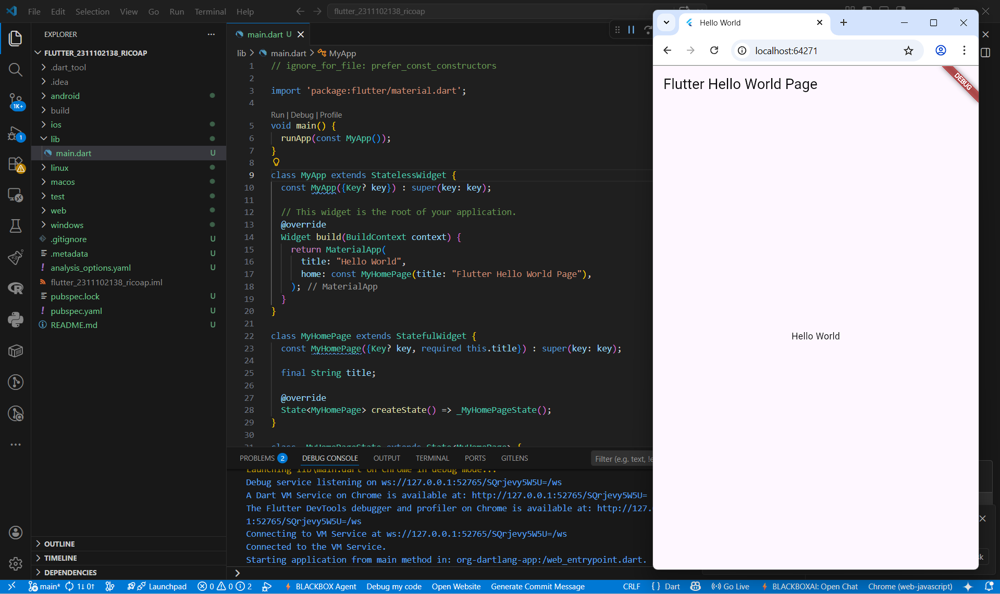

<div align="center">
   <h2>LAPORAN PRAKTIKUM<br>APLIKASI BERBASIS PLATFORM</h2>
   <h>
   <br>
   <h4>MODUL 01, 02 Mobile<br>Pengenalan Flutter Hello World</h4>
   <br>
   
   <br><br>
 
**Disusun Oleh :**<br>
RICO ADE PRATAMA<br>
2311102138<br>
PS1IF-11-REG01
<br><br>
 
**Dosen Pengampu :**<br>
Dimas Fanny Hebrasianto Permadi, S.ST., M.Kom
<br><br>
 
**Assisten Praktikum :**<br>
Apri Pandu Wicaksono
<br>Rangga Pradarrell Fathi
<br><br>
 
PROGRAM STUDI S1 TEKNIK INFORMATIKA<br>
FAKULTAS INFORMATIKA<br>
UNIVERSITAS TELKOM PURWOKERTO<br>
2026

</div>

---

## 1. Dasar Teori

**Flutter** merupakan sebuah teknologi yang ditulis menggunakan bahasa pemrograman C, C++, dan Dart, serta didukung oleh Google's Skia Graphics Engine untuk merancang antarmuka pengguna (user interface). Flutter beroperasi menggunakan Dart Virtual Machine (VM) pada berbagai sistem operasi, termasuk Windows, Linux, dan macOS. Sistem Dart VM ini menerapkan kompilasi kode just-in-time (JIT) yang menyediakan fitur hot-reload, sehingga mampu menghemat waktu pengembangan aplikasi secara signifikan.

Dalam pengembangan antarmukanya, Flutter API menggabungkan beberapa komponen yang disebut widget sesuai dengan kebutuhan aplikasi yang sedang dibangun. Konsep dasar yang diterapkan dalam penyusunan tampilan ini adalah widget tree, yakni sebuah implementasi di mana suatu widget dapat memuat widget lain di dalamnya untuk mewakili sebuah komponen antarmuka. Widget pada Flutter terbagi menjadi dua jenis, yaitu stateless dan stateful, di mana perbedaan keduanya bergantung pada status dari widget itu sendiri. Konsep ini sangat berguna dalam membantu mengelola status jalannya sebuah aplikasi. Selain itu, Flutter juga menerapkan arsitektur yang dikenal sebagai Business Logic Component (BLOC), yang menjadi pendekatan sangat baik guna memisahkan antara logika bisnis dari tampilan antarmuka.

## 2. Kode Program Unguided

Membuat Hello World saja

### Struktur Program

```php
flutter_2311102138_ricoap/  # Folder utama proyek Flutter
│   └── lib/                # Direktori utama penyimpanan kode Dart
│       └── main.dart       # Titik awal eksekusi program
```

### Kode main.dart (Folder lib)

```php
// ignore_for_file: prefer_const_constructors

import 'package:flutter/material.dart';

void main() {
  runApp(const MyApp());
}

class MyApp extends StatelessWidget {
  const MyApp({Key? key}) : super(key: key);

  // This widget is the root of your application.
  @override
  Widget build(BuildContext context) {
    return MaterialApp(
      title: "Hello World",
      home: const MyHomePage(title: "Flutter Hello World Page"),
    );
  }
}

class MyHomePage extends StatefulWidget {
  const MyHomePage({Key? key, required this.title}) : super(key: key);

  final String title;

  @override
  State<MyHomePage> createState() => _MyHomePageState();
}

class _MyHomePageState extends State<MyHomePage> {
  @override
  Widget build(BuildContext context) {
    return Scaffold(
      appBar: AppBar(title: Text(widget.title)),
      body: Center(child: Text('Hello World')),
    );
  }
}

```

### Hasil Proyek



### Penjelasan Kode

Program ini merupakan kode dasar untuk membangun aplikasi Flutter sederhana yang menampilkan teks pada layar. Eksekusi program dimulai dari fungsi `main()` yang memanggil perintah `runApp()` untuk menginisialisasi dan menjalankan kerangka utama aplikasi yang direpresentasikan oleh kelas `MyApp`(StatelessWidget) sebagai root widget dengan konfigurasi desain dari `MaterialApp`. Aplikasi kemudian memuat `MyHomePage` (StatefulWidget) sebagai halaman beranda dinamis yang tata letaknya disusun oleh widget `Scaffold`. Layar tersebut dibagi menjadi `appBar` untuk judul navigasi dan `body` sebagai area konten utama, di mana widget `Center` mengapit widget `Text` sehingga tulisan "Hello World" tampil persis di tengah layar. Lebih Jelasnya yang Hasil Output seperti gambar diatas.

## 3. Kesimpulan dan Penutup

Tugas Praktikum Modul 01 dan 02 ini mengimplementasikan fondasi awal aplikasi mobile dengan fokus pada integrasi framework Flutter dan bahasa pemrograman Dart, serta penerapan komponen UI dasar (StatelessWidget & StatefulWidget) untuk merender tampilan "Hello World". Cocok digunakan sebagai pembelajaran praktikum bagi mahasiswa program studi Informatika untuk membangun aplikasi modern.

## 4. Referensi

- [1] [Materi Modul 01, 02 Mobile](https://drive.google.com/drive/folders/1ug7dmm-aVF-NG9-YT5kT519HdGmkXaD-?usp=sharing)
