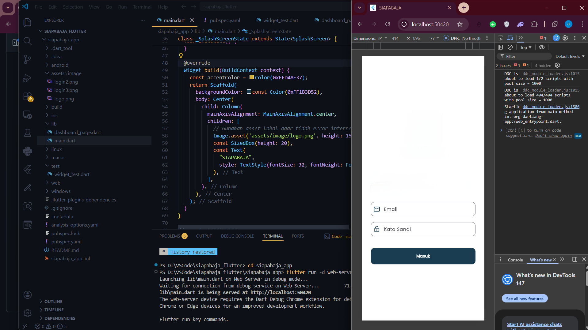

   
  <h1>MODUL 01,02 - Mobile Flutter</h1>
   
   
   
  
   
   
   
  <h3>Disusun Oleh :</h3>
  

    <strong>Syamsul Adam</strong> 
    <strong>2311102144</strong> 
    <strong>S1 IF-11-01</strong>
  

   
  <h3>Dosen Pengampu :</h3>
  

    <strong>Dimas Fanny Hebrasianto Permadi, S.ST., M.Kom</strong>
  

   
  <h4>Asisten Praktikum :</h4>
  <strong>Apri Pandu Wicaksono</strong>  
  <strong>Rangga Pradarrell Fathi</strong>
   
  <h3>LABORATORIUM HIGH PERFORMANCE
  FAKULTAS INFORMATIKA  UNIVERSITAS TELKOM PURWOKERTO  2026</h3>

---

# 1. Dasar Teori
Flutter adalah framework UI dari Google yang memungkinkan pembuatan aplikasi multi-platform secara efisien melalui arsitektur tanpa jembatan (bridge-less), di mana mesin grafis Skia atau Impeller merender setiap piksel secara langsung ke layar. Dengan bahasa pemrograman Dart, Flutter mengombinasikan produktivitas fitur hot reload saat pengembangan serta performa tinggi hasil kompilasi AOT (Ahead-of-Time) saat produksi. Seluruh antarmuka dibangun menggunakan sistem hierarki widget yang deklaratif, memungkinkan pengembang menciptakan pengalaman pengguna yang konsisten dan responsif di perangkat mobile, web, maupun desktop dengan satu basis kode saja.

Flutter ditulis menggunakan bahasa C, C++ dan Dart dengan Google’s Skia Graphics Engine untuk user interface. Engine yang digunakan untuk produk ini dikenal seperti Google Chrome, Chrome OS,Chromium OS, Mozilla Firefox, Mozilla Thunderbird, Android, Firefox OS dan sekarang Flutter.Flutter berjalan menggunakan Dart Virtual Machine (VM) di sistem operasi Windows, Linux, dan macOS. Dart VM menggunakan kompilasi kode just-in-time (JIT) yang menyediakan fitur hot-reload untuk menghemat waktu pengembangan

---

## Hasil Hello World

### Refrensi

- Flutter Docs: [https://docs.flutter.dev](https://docs.flutter.dev)
- Dart: [https://dart.dev](https://dart.dev)