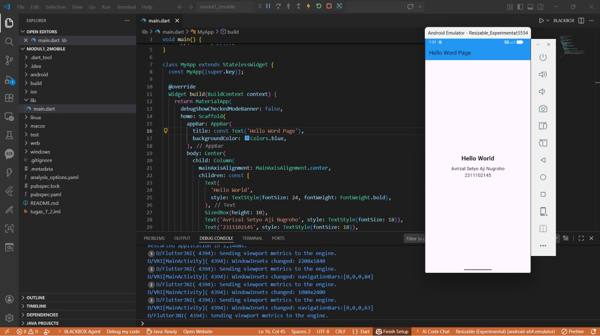

<div align="center">
  <br />
  <h1>LAPORAN PRAKTIKUM</h1>
  <h2>APLIKASI BERBASIS PLATFORM</h2>
  <br />
  <h3>Flutter Hello World</h3>
  <br />
  <br />
  
  <br />
  <br />
  <h3>Disusun Oleh :</h3>
  <p>
    <strong>AVRIZAL SETYO AJI NUGROHO</strong><br>
    <strong>2311102145</strong><br>
    <strong>S1 IF-11-REG01</strong>
  </p>
  <br />
  <h3>Dosen Pengampu :</h3>
  <p>
    <strong>Dimas Fanny Hebrasianto Permadi, S.ST., M.Kom</strong>
  </p>
  <br />
  <h4>Asisten Praktikum :</h4>
  <p>
    <strong>Apri Pandu Wicaksono</strong><br>
    <strong>Rangga Pradarrell Fathi</strong>
  </p>
  <br />
  <h3>
    LABORATORIUM HIGH PERFORMANCE<br>
    FAKULTAS INFORMATIKA<br>
    UNIVERSITAS TELKOM PURWOKERTO<br>
    2026
  </h3>
</div>

---

## 1. Dasar Teori Flutter

**Flutter** merupakan solusi open-source dari Google yang memungkinkan pengembangan aplikasi multiplatform secara efisien melalui satu basis kode menggunakan bahasa Dart dan mesin render Skia. Keunggulan utamanya terletak pada fitur hot reload berbasis kompilasi JIT yang mempercepat proses revisi kode, serta penggunaan struktur widget tree yang membagi komponen menjadi stateless dan stateful untuk pengelolaan antarmuka yang lebih modular. Untuk menjaga kualitas kode, Flutter mendukung arsitektur seperti BLoC yang memisahkan logika bisnis dari tampilan melalui pemrosesan event dan state, yang biasanya dipelajari pertama kali oleh pengembang melalui pembuatan aplikasi sederhana "Hello World" guna memahami fondasi dasar seperti widget MaterialApp, Scaffold, dan Center.

---

## 2. Penjelasan Kode

```dart
import 'package:flutter/material.dart';

void main() {
  runApp(const MyApp());
}

class MyApp extends StatelessWidget {
  const MyApp({super.key});

  @override
  Widget build(BuildContext context) {
    return MaterialApp(
      debugShowCheckedModeBanner: false,
      home: Scaffold(
        appBar: AppBar(
          title: const Text('Hello Word Page'),
          backgroundColor: Colors.blue,
        ),
        body: Center(
          child: Column(
            mainAxisAlignment: MainAxisAlignment.center,
            children: const [
              Text(
                'Hello World',
                style: TextStyle(fontSize: 24, fontWeight: FontWeight.bold),
              ),
              SizedBox(height: 10),
              Text('Avrizal Setyo Aji Nugroho', style: TextStyle(fontSize: 18)),
              Text('2311102145', style: TextStyle(fontSize: 18)),
            ],
          ),
        ),
      ),
    );
  }
}

```

Kode tersebut merupakan struktur aplikasi Flutter dasar yang menggunakan `StatelessWidget` sebagai komponen utamanya. Fungsi `main()` menjalankan `MaterialApp` yang berfungsi sebagai pembungkus desain, sementara widget `Scaffold` digunakan untuk membangun kerangka halaman yang mencakup `AppBar` berwarna biru di bagian atas dan area `body` untuk menampung konten utama.

Di bagian konten, widget `Center` dan `Column` digunakan untuk menyusun elemen teks agar berada tepat di tengah layar secara vertikal maupun horizontal. Aplikasi ini menampilkan tiga buah widget `Text` yang berisi sapaan **"Hello World"** serta identitas pengguna (nama dan NIM), dengan tambahan `SizedBox` yang berfungsi memberikan ruang pemisah antar teks agar tampilan terlihat lebih rapi dan terstruktur.

---

## 3. Screenshot Hasil



---

## 4. Referensi

- Dart: [https://dart.dev](https://dart.dev)
- Flutter Docs: [https://docs.flutter.dev](https://docs.flutter.dev)
