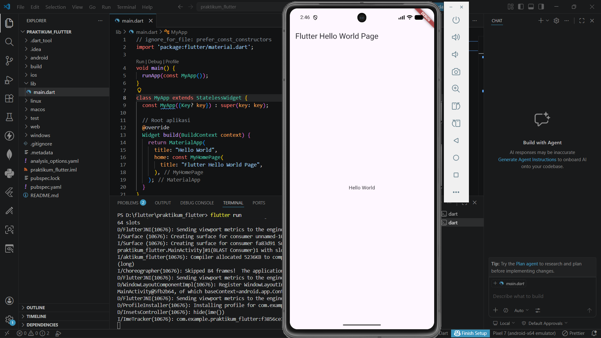

<div align="center">
  <br />
  <h1>LAPORAN PRAKTIKUM</h1>
  <h2>APLIKASI BERBASIS PLATFORM</h2>
  <br />
  <h3>Flutter Hello World</h3>
  <br />
  <br />
  
  <br />
  <br />
  <h3>Disusun Oleh :</h3>
  <p>
    <strong>DANENDRA ARDEN SHADUQ</strong><br>
    <strong>2311102146</strong><br>
    <strong>S1 IF-11-REG01</strong>
  </p>
  <br />
  <h3>Dosen Pengampu :</h3>
  <p>
    <strong>Dimas Fanny Hebrasianto Permadi, S.ST., M.Kom</strong>
  </p>
  <br />
  <h4>Asisten Praktikum :</h4>
  <p>
    <strong>Apri Pandu Wicaksono</strong><br>
    <strong>Rangga Pradarrell Fathi</strong>
  </p>
  <br />
  <h3>
    LABORATORIUM HIGH PERFORMANCE<br>
    FAKULTAS INFORMATIKA<br>
    UNIVERSITAS TELKOM PURWOKERTO<br>
    2026
  </h3>
</div>

---

## 1. Dasar Teori Flutter

**Flutter** merupakan framework open-source yang dikembangkan oleh Google untuk membangun aplikasi berbasis mobile, web, maupun desktop dengan satu basis kode. Flutter ditulis menggunakan bahasa pemrograman Dart serta memanfaatkan Skia Graphics Engine untuk merender antarmuka pengguna. Dengan dukungan Dart Virtual Machine (VM), Flutter mampu menjalankan proses kompilasi secara just-in-time (JIT) yang memungkinkan fitur *hot reload*, sehingga pengembang dapat melihat perubahan kode secara langsung tanpa harus melakukan build ulang aplikasi secara penuh. 

Dalam pengembangan antarmuka, Flutter menggunakan konsep utama berupa *widget tree*, yaitu struktur hierarki widget di mana setiap komponen tampilan direpresentasikan sebagai widget. Widget dalam Flutter terbagi menjadi dua jenis, yaitu *stateless widget* yang tidak memiliki perubahan state, dan *stateful widget* yang dapat berubah sesuai interaksi pengguna atau kondisi tertentu. Konsep ini mempermudah pengelolaan tampilan serta status aplikasi secara terstruktur dan modular. 

Selain itu, Flutter juga memiliki arsitektur yang mendukung pengelolaan logika aplikasi secara terpisah dari tampilan, salah satunya menggunakan pendekatan Business Logic Component (BLoC). Arsitektur ini bekerja dengan memproses event yang terjadi pada aplikasi dan menghasilkan perubahan state sebagai respons. Dengan memisahkan logika bisnis dari antarmuka pengguna, BLoC membantu meningkatkan kemudahan dalam pengembangan, skalabilitas, serta pengujian aplikasi. 

Sebagai langkah awal dalam mempelajari Flutter, biasanya dibuat aplikasi sederhana seperti “Hello World”. Aplikasi ini bertujuan untuk memperkenalkan struktur dasar program Flutter, termasuk penggunaan widget utama seperti MaterialApp, Scaffold, AppBar, serta pengaturan tampilan menggunakan widget seperti Text dan Center. Melalui contoh sederhana ini, pengembang dapat memahami alur dasar pembuatan aplikasi Flutter mulai dari inisialisasi hingga penampilan antarmuka pengguna. 

---

## 2. Penjelasan Kode

```dart
// ignore_for_file: prefer_const_constructors
import 'package:flutter/material.dart';

void main() {
  runApp(const MyApp());
}

class MyApp extends StatelessWidget {
  const MyApp({Key? key}) : super(key: key);

  // Root aplikasi
  @override
  Widget build(BuildContext context) {
    return MaterialApp(
      title: "Hello World",
      home: const MyHomePage(
        title: "Flutter Hello World Page",
      ),
    );
  }
}

class MyHomePage extends StatefulWidget {
  const MyHomePage({
    Key? key,
    required this.title,
  }) : super(key: key);

  final String title;

  @override
  State<MyHomePage> createState() => _MyHomePageState();
}

class _MyHomePageState extends State<MyHomePage> {
  @override
  Widget build(BuildContext context) {
    return Scaffold(
      appBar: AppBar(
        title: Text(widget.title),
      ),
      body: const Center(
        child: Text(
          'Hello World',
        ),
      ),
    );
  }
}
```

Kode program tersebut merupakan aplikasi sederhana “Hello World” menggunakan framework Flutter yang dimulai dari fungsi `main()` sebagai titik awal eksekusi program. Pada fungsi ini, `runApp()` dipanggil untuk menjalankan widget utama yaitu `MyApp`. Kelas `MyApp` merupakan turunan dari `StatelessWidget`, yang berarti widget ini tidak memiliki perubahan state selama aplikasi berjalan. Di dalam method `build()`, `MyApp` mengembalikan `MaterialApp` sebagai kerangka dasar aplikasi, yang berisi properti seperti `title` serta `home` yang mengarah ke halaman utama `MyHomePage`.

Selanjutnya, `MyHomePage` merupakan `StatefulWidget` yang digunakan karena halaman ini memiliki potensi untuk berubah (state). Widget ini menerima parameter `title` yang akan ditampilkan pada AppBar. State dari widget ini dikelola oleh kelas `_MyHomePageState`, yang mengoverride method `build()` untuk menentukan tampilan antarmuka. Pada bagian ini digunakan `Scaffold` sebagai struktur dasar layout, yang menyediakan komponen seperti `AppBar` dan `body`. `AppBar` menampilkan judul yang diambil dari `widget.title`, sedangkan bagian `body` berisi widget `Center` untuk memposisikan konten di tengah layar, yaitu widget `Text` yang menampilkan tulisan “Hello World”. Secara keseluruhan, kode ini menunjukkan struktur dasar aplikasi Flutter yang terdiri dari widget sebagai penyusun utama antarmuka pengguna.


---

## 3. Screenshot Hasil



---

## 4. Referensi

- Flutter Docs: [https://docs.flutter.dev](https://docs.flutter.dev)
- Dart: [https://dart.dev](https://dart.dev)
