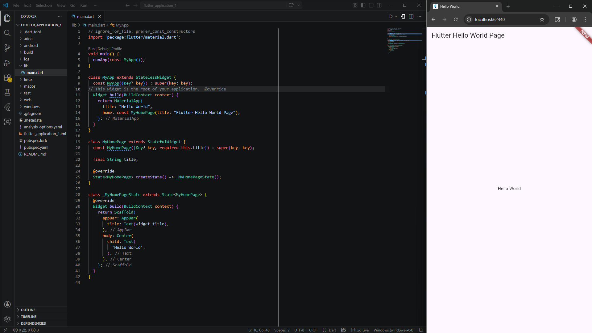

<div align="center">

<br>

# LAPORAN PRAKTIKUM  
# APLIKASI BERBASIS PLATFORM

<br>

## MODUL 01,02  
## Mobile - Pengenalan Flutter

<br>


<br><br>

### Disusun Oleh

**Yoga Hogantara**  
**2311102153**  
**S1 IF-11-REG01**

<br>

### Dosen Pengampu

**Dimas Fanny Hebrasianto Permadi, S.ST., M.Kom**

<br>

### Asisten Praktikum

**Apri Pandu Wicaksono**  
**Rangga Pradarrell Fathi**

<br><br>

### LABORATORIUM HIGH PERFORMANCE  
### FAKULTAS INFORMATIKA  
### UNIVERSITAS TELKOM PURWOKERTO  
### 2026

</div>

---

# 1. Dasar Teori
**Flutter** merupakan framework open-source besutan Google yang dirancang untuk membangun aplikasi lintas platform—mulai dari mobile, web, hingga desktop—hanya dengan satu basis kode (codebase). Framework ini menggunakan bahasa pemrograman Dart dan mesin grafis Skia untuk memastikan performa visual yang maksimal.

Salah satu keunggulan utamanya adalah fitur Hot Reload. Berkat dukungan Dart VM dan kompilasi JIT, pengembang dapat melihat perubahan kode secara instan di layar tanpa harus melakukan proses build ulang yang memakan waktu. Hal ini tentu meningkatkan efisiensi selama proses pengembangan.

**Struktur dan Arsitektur**
Dalam Flutter, antarmuka aplikasi dibangun menggunakan konsep Widget Tree, di mana UI tersusun secara hierarkis. Widget tersebut terbagi menjadi dua jenis utama:

* Stateless Widget: Untuk tampilan yang bersifat statis atau tidak berubah.

* Stateful Widget: Untuk tampilan dinamis yang dapat berubah sesuai interaksi pengguna.

Agar aplikasi tetap rapi, terstruktur, dan mudah diuji (scalable), Flutter mendukung pola arsitektur seperti BLoC. Arsitektur ini berfungsi memisahkan antara logika bisnis dengan tampilan (UI), sehingga pengelolaan data menjadi lebih konsisten.

---

# 2. Penjelasan Code
```
// ignore_for_file: prefer_const_constructors
import 'package:flutter/material.dart';

void main() {
  runApp(const MyApp());
}

class MyApp extends StatelessWidget {
  const MyApp({Key? key}) : super(key: key);
// This widget is the root of your application.  @override
  Widget build(BuildContext context) {
    return MaterialApp(
      title: "Hello World",
      home: const MyHomePage(title: "Flutter Hello World Page"),
    );
  }
}

class MyHomePage extends StatefulWidget {
  const MyHomePage({Key? key, required this.title}) : super(key: key);

  final String title;

  @override
  State<MyHomePage> createState() => _MyHomePageState();
}

class _MyHomePageState extends State<MyHomePage> {
  @override
  Widget build(BuildContext context) {
    return Scaffold(
      appBar: AppBar(
        title: Text(widget.title),
      ),
      body: Center(
        child: Text(
          'Hello World',
        ),
      ),
    );
  }
}

```
Program ini diawali dengan fungsi main() yang bertindak sebagai titik masuk utama (entry point) aplikasi. Di dalam fungsi tersebut, terdapat perintah runApp(const MyApp()) yang berfungsi untuk memulai dan menampilkan root widget ke layar perangkat. MyApp dikonfigurasi menggunakan MaterialApp, sebuah komponen dasar yang mengatur tema dan identitas aplikasi, serta menentukan bahwa halaman pertama yang akan dimuat adalah MyHomePage.

Halaman utama didefinisikan menggunakan StatefulWidget, yang memberikan fleksibilitas bagi aplikasi jika nantinya terdapat perubahan data atau interaksi yang memengaruhi tampilan secara dinamis. Logika antarmuka kemudian disusun di dalam kelas _MyHomePageState menggunakan widget Scaffold. Scaffold ini berperan sebagai kerangka utama untuk menyusun elemen-elemen standar UI, seperti AppBar yang terletak di bagian atas sebagai header halaman.

Pada bagian konten utama atau body, kode ini menggunakan widget Center untuk memastikan elemen di dalamnya berada tepat di tengah layar. Di dalam widget tersebut, terdapat widget Text yang bertugas menampilkan pesan "Hello World". Secara keseluruhan, struktur ini menunjukkan bagaimana Flutter menyusun setiap elemen secara hierarkis dalam sebuah widget tree untuk menciptakan antarmuka yang rapi dan terorganisir.

# 3. Screenshot
##  Hello world


# 4. Referensi
* Flutter Docs : https://docs.flutter.dev
* Dart : https://dart.dev