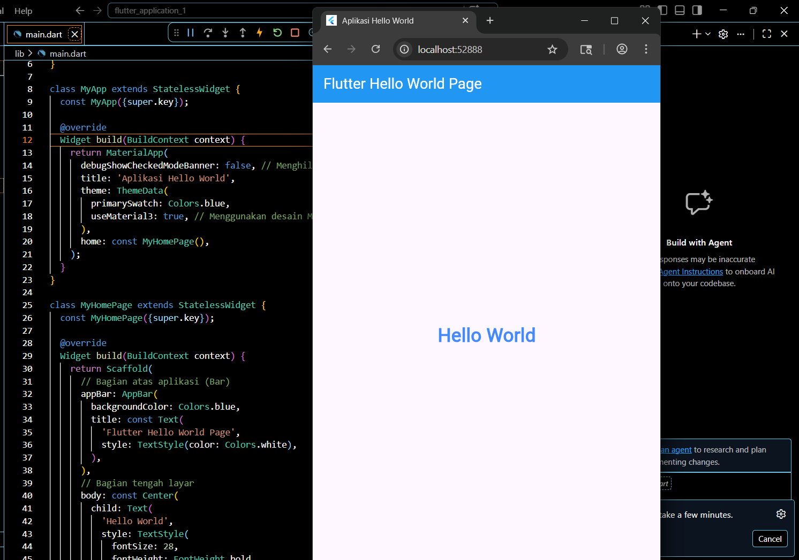

   
  <h1>LAPORAN PRAKTIKUM  APLIKASI BERBASIS PLATFORM</h1>
   
  <h3> Modul 01-02 Mobile   Hello World</h3>
   
   
   
   
   
  <h3>Disusun Oleh :</h3>
  

    <strong>Mohammad Alfan Naraya</strong> 
    <strong>2311102170</strong> 
    <strong>S1 IF-11-01</strong>
  

   
  <h3>Dosen Pengampu :</h3>
  

    <strong>Dimas Fanny Hebrasianto Permadi, S.ST., M.Kom</strong>
  

   
   
    <h4>Asisten Praktikum :</h4>
    <strong> Apri Pandu Wicaksono </strong>  
    <strong>Rangga Pradarrell Fathi</strong>
   
  <h3>LABORATORIUM HIGH PERFORMANCE
  FAKULTAS INFORMATIKA  UNIVERSITAS TELKOM PURWOKERTO  2026</h3>

## 1. Penjelasan Lengkap Pembuatan Proyek

### A. Flutter
Flutter adalah framework sumber terbuka (open-source) yang dikembangkan oleh Google untuk membangun aplikasi antarmuka (UI) yang cantik, dikompilasi secara asli (natively compiled), dan berperforma tinggi hanya dari satu basis kode tunggal, sehingga memungkinkan pengembang menulis kode sekali untuk dijalankan di Android, iOS, web, hingga desktop. Kekuatan utamanya terletak pada bahasa pemrograman Dart yang mendukung fitur Hot Reload untuk melihat perubahan kode secara instan tanpa kehilangan kondisi aplikasi, serta arsitektur berbasis widget yang memberikan fleksibilitas penuh dalam menyusun hierarki visual yang kompleks. Berbeda dengan pendekatan tradisional, Flutter menggunakan mesin perenderan sendiri seperti Skia atau Impeller untuk menggambar setiap piksel langsung di layar, menjamin performa halus hingga 120 FPS dan konsistensi tampilan di berbagai platform. Dengan dukungan ekosistem luas melalui repositori pub.dev, Flutter memfasilitasi integrasi cepat dengan berbagai layanan seperti Firebase dan sensor perangkat, menjadikannya solusi efisien bagi mahasiswa maupun pengembang profesional untuk membangun aplikasi modern yang skalabel.Menggunakan bahasa pemrograman Dart, Flutter mengandalkan sistem widget yang sangat fleksibel, di mana hampir setiap elemen di layar adalah komponen yang bisa dikustomisasi sepenuhnya. Salah satu fitur unggulannya adalah Stateful Hot Reload, yang memungkinkan pengembang melihat perubahan kode secara instan tanpa harus mengulang proses restart aplikasi, sehingga mempercepat siklus pengembangan secara signifikan.

### Hasil Penugasan

