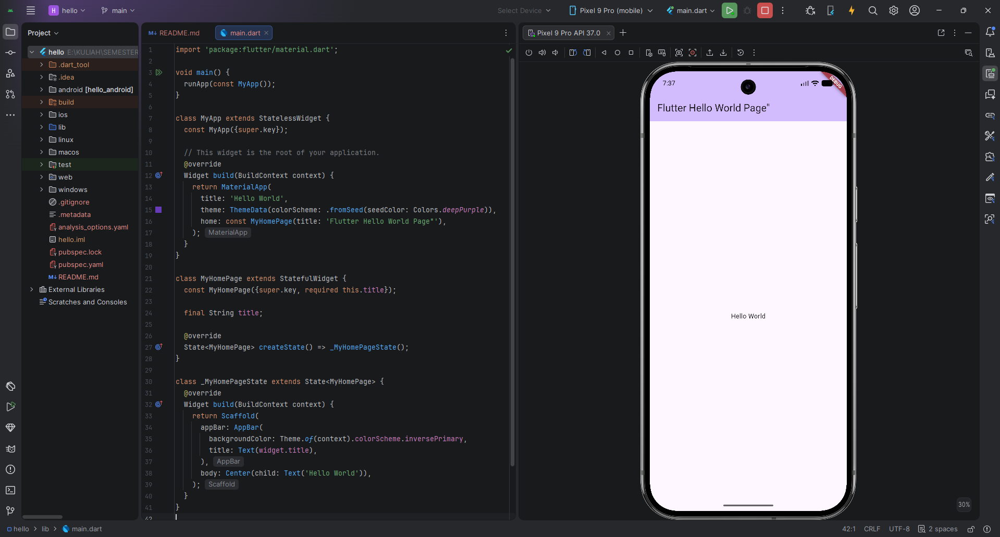

   

  <h1>LAPORAN PRAKTIKUM  
  APLIKASI BERBASIS PLATFORM
  </h1>

   

  <h3>MODUL 01-02  
  Mobile
  </h3>

   

  

   
   
   

  <h3>Disusun Oleh :</h3>

  

    <strong>Irshad Benaya Fardeca</strong> 
    <strong>2311102199</strong> 
    <strong>S1 IF-11-REG01</strong>
  

   

  <h3>Dosen Pengampu :</h3>

  

    <strong>Dimas Fanny Hebrasianto Permadi, S.ST., M.Kom</strong>
  

  
   
   
    <h4>Asisten Praktikum :</h4>
    <strong>Apri Pandu Wicaksono </strong>  
    <strong>Rangga Pradarrell Fathi</strong>
   

  <h3>LABORATORIUM HIGH PERFORMANCE
  FAKULTAS INFORMATIKA  UNIVERSITAS TELKOM PURWOKERTO  2026</h3>

# Tugas
Menampilkan Hello World menggunakan framework Flutter

---

### Output:
