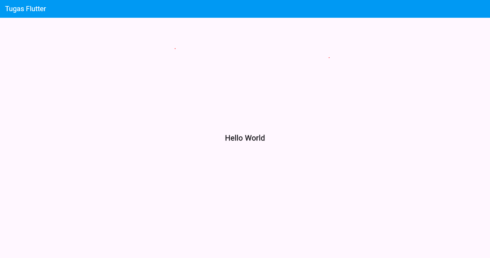

   
  <h1>MODUL 01,02 - Mobile Pengenalan Flutter</h1>
   
   
   
  
   
   
   
  <h3>Disusun Oleh :</h3>
  

    <strong>M. Faleno Albar Firjatulloh</strong> 
    <strong>2311102297</strong> 
    <strong>S1 IF-11-01</strong>
  

   
  <h3>Dosen Pengampu :</h3>
  

    <strong>Dimas Fanny Hebrasianto Permadi, S.ST., M.Kom</strong>
  

   
  <h4>Asisten Praktikum :</h4>
  <strong>Apri Pandu Wicaksono</strong>  
  <strong>Rangga Pradarrell Fathi</strong>
   
  <h3>LABORATORIUM HIGH PERFORMANCE
  FAKULTAS INFORMATIKA  UNIVERSITAS TELKOM PURWOKERTO  2026</h3>

---

# 1. Dasar Teori

Flutter adalah framework open-source dari Google untuk membangun aplikasi mobile, web, dan desktop dengan satu codebase menggunakan bahasa Dart dan Skia Graphics Engine. Dengan dukungan Dart VM dan kompilasi JIT, Flutter menyediakan fitur hot reload yang memungkinkan perubahan kode langsung terlihat tanpa build ulang.

Flutter menggunakan konsep widget tree, di mana UI dibangun dari widget yang tersusun hierarkis, terdiri dari stateless dan stateful widget. Untuk arsitektur, Flutter mendukung pemisahan logika dan tampilan, salah satunya dengan BLoC, yang mengelola event dan state agar aplikasi lebih terstruktur, scalable, dan mudah diuji.

Sebagai awal, biasanya dibuat aplikasi “Hello World” untuk memahami struktur dasar seperti MaterialApp, Scaffold, AppBar, serta widget Text dan Center.

---

## Hasil Hello World

### Refrensi

- Flutter Docs: [https://docs.flutter.dev](https://docs.flutter.dev)
- Dart: [https://dart.dev](https://dart.dev)