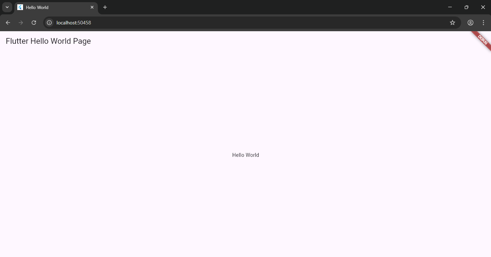

   
  <h1>LAPORAN PRAKTIKUM  
  APLIKASI BERBASIS PLATFORM
  </h1>
   
  <h3>MODUL 1 & 2  
  MOBILE
  </h3>
   
  
   
   
   
  <h3>Disusun Oleh :</h3>
  

    <strong>Boutefhika Nuha Ziyadatul Khair</strong> 
    <strong>2311102316</strong> 
    <strong>S1 IF-11-01</strong>
  

   
  <h3>Dosen Pengampu :</h3>
  

    <strong>Dimas Fanny Hebrasianto Permadi, S.ST., M.Kom</strong>
  

   
   
  <h4>Asisten Praktikum :</h4>
  <strong>Apri Pandu Wicaksono</strong>  
  <strong>Rangga Pradarrell Fathi</strong>
   
   
  <h3>LABORATORIUM HIGH PERFORMANCE
   FAKULTAS INFORMATIKA  UNIVERSITAS TELKOM PURWOKERTO  2026</h3>

# Hasil Flutter

